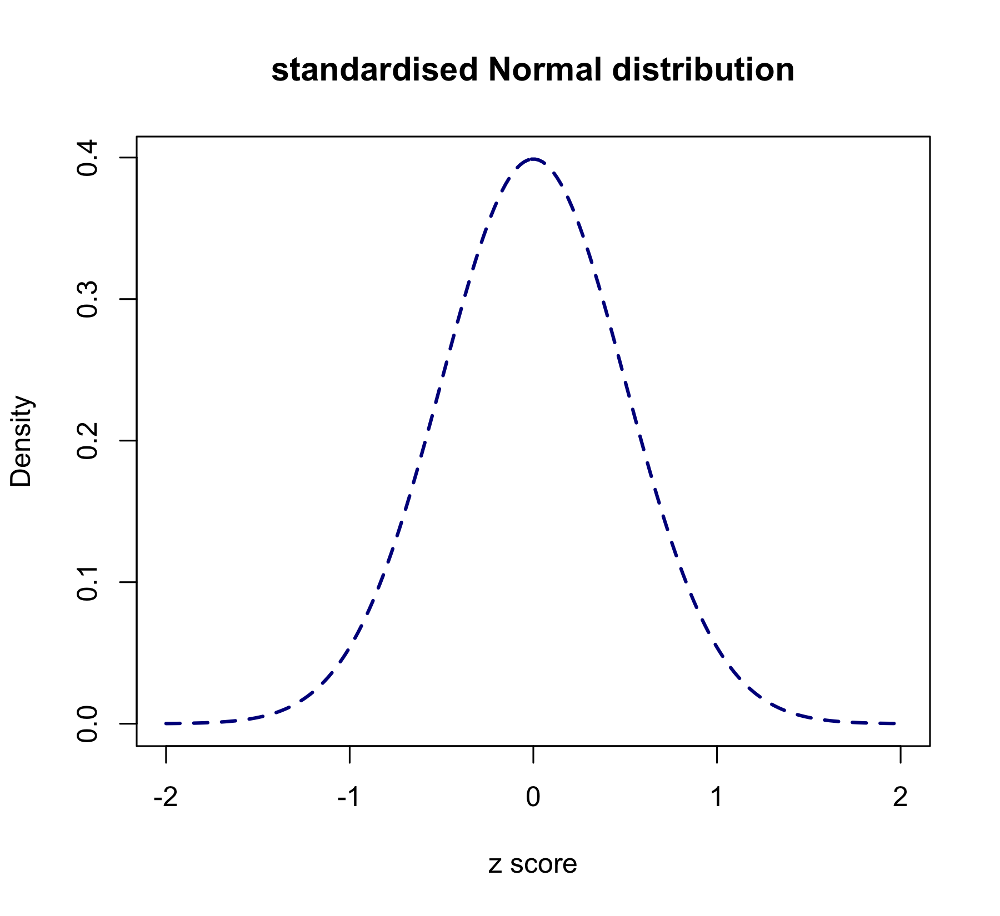

Statistics in R
========================================================
author: MRC London Institute of Medical Sciences (http://bioinformatics.lms.mrc.ac.uk)
date: 25/Sep/2018
width: 1440
height: 1100
autosize: true
font-import: <link href='http://fonts.googleapis.com/css?family=Slabo+27px' rel='stylesheet' type='text/css'>
font-family: 'Slabo 27px', serif;
css:style.css

Outline
========================================================

- data summary

- hypothesis testing and ANOVA

- correlation and linear regression

- we only have 1 hour and 45 minutes...

Materials.
========================================================
id: materials

All prerequisites, links to material and slides for this course can be found on github.
* [StatisticsInR](http://mrccsc.github.io/StatisticsInR/)

Or can be downloaded as a zip archive from here.
* [Download zip](https://github.com/mrccsc/StatisticsInR/zipball/master)

Materials. - Presentations, source code and practicals.
========================================================

Once the zip files are unzipped, all presentations are available as HTML slides and pages. Practical sheets will be available in the directories underneath.

* **exercises/**
Practicals as HTML pages.
* **answers/**
Practicals with answers as HTML pages.

Set the Working directory
========================================================

Before running any of the code in the practicals or slides we need to set the working directory to the folder we unarchived.

You may navigate to the unarchived Reproducible-R folder in the Rstudio menu

**Session -> Set Working Directory -> Choose Directory**

or in the console.


```r
setwd("/Users/yfwang27/workfromhome/workshop/StatisticsR_CBW18")
# e.g. setwd("~/Downloads/StatisticsInR/Statistics2016")
```

Case study
========================================================
Start from some data for mouse strain BKS.Cg-Dock7m +/+ Leprdb/J (db/db)

Data Source: Jackson Laboratory


Save excel file as csv file
========================================================


We don't need a pretty excel file for the csv format
========================================================


Load data
========================================================


```r
> alldata<-read.csv(file="data/mouse_BW_Fat_Glu_info.csv")
```

Data summary
========================================================

- data type

- spread of data

- shape of data

- distribution


Data type
========================================================

data type

- continuous

eg. blood pressure, body weight, height ...

- discrete

eg. gender, hair colour, RNA-seq read count...


Recap some basic R functions (1/6)
========================================================
- **str()**, **head()**, **dim()**, **colnames()** and **summary()** functions
- more details please see [Reproducible R course](http://mrccsc.github.io/Reproducible-R/)

-- [Data types in R](http://mrccsc.github.io/Reproducible-R/r_course/presentations/slides/introToR_Session1.html#/datatypes)


Recap some basic R functions (2/6)
========================================================

**head()**: See the first 6 lines of an R object

```r
> head(alldata)
```

```
     mouseID Sex Genotype Age ID BW.gram FatTissue.percent GLU.mg.dL
1 F_+/+_16_1   F      +/+  16  1   29.98              20.0       162
2 F_+/+_16_2   F      +/+  16  2   20.03              20.4       170
3 F_+/+_16_3   F      +/+  16  3   21.94              25.2       155
4 F_+/+_16_4   F      +/+  16  4   21.60              20.0       181
5  F_+/+_8_1   F      +/+   8  1   19.55              22.9       135
6  F_+/+_8_2   F      +/+   8  2   17.38              22.0       146
```

Recap some basic R functions (3/6)
========================================================
see the how many rows and columns in "alldata" object

```r
> dim(alldata)
```

```
[1] 74  8
```

see column names of "alldata"

```r
> colnames(alldata)
```

```
[1] "mouseID"           "Sex"               "Genotype"         
[4] "Age"               "ID"                "BW.gram"          
[7] "FatTissue.percent" "GLU.mg.dL"        
```

Recap some basic R functions (4/6)
========================================================

**str()**: Compactly display the internal structure of an R object

```r
> str(alldata)
```

```
'data.frame':	74 obs. of  8 variables:
 $ mouseID          : Factor w/ 74 levels "F_+/+_16_1","F_+/+_16_2",..: 1 2 3 4 5 6 7 8 9 10 ...
 $ Sex              : Factor w/ 2 levels "F","M": 1 1 1 1 1 1 1 1 1 1 ...
 $ Genotype         : Factor w/ 3 levels "+/+","db/+","db/db": 1 1 1 1 1 1 1 1 1 2 ...
 $ Age              : int  16 16 16 16 8 8 8 8 8 16 ...
 $ ID               : int  1 2 3 4 1 2 3 4 5 1 ...
 $ BW.gram          : num  30 20 21.9 21.6 19.6 ...
 $ FatTissue.percent: num  20 20.4 25.2 20 22.9 22 26 25.2 21.5 33.4 ...
 $ GLU.mg.dL        : int  162 170 155 181 135 146 152 153 144 159 ...
```

Recap some basic R functions (5/6)
========================================================


```r
> summary(alldata)
```

```
       mouseID   Sex     Genotype       Age           ID       
 F_+/+_16_1: 1   F:35   +/+  :19   Min.   : 8   Min.   : 1.00  
 F_+/+_16_2: 1   M:39   db/+ :15   1st Qu.: 8   1st Qu.: 2.00  
 F_+/+_16_3: 1          db/db:40   Median :12   Median : 4.00  
 F_+/+_16_4: 1                     Mean   :12   Mean   : 4.23  
 F_+/+_8_1 : 1                     3rd Qu.:16   3rd Qu.: 6.00  
 F_+/+_8_2 : 1                     Max.   :16   Max.   :10.00  
 (Other)   :68                                                 
    BW.gram      FatTissue.percent   GLU.mg.dL    
 Min.   :16.04   Min.   :20.00     Min.   :131.0  
 1st Qu.:26.87   1st Qu.:26.70     1st Qu.:195.8  
 Median :38.15   Median :54.15     Median :509.0  
 Mean   :37.36   Mean   :44.91     Mean   :448.1  
 3rd Qu.:47.80   3rd Qu.:60.70     3rd Qu.:664.2  
 Max.   :61.97   Max.   :71.10     Max.   :876.0  
                                                  
```

Recap some basic R functions (6/6)
========================================================

**ftable()**: Create ‘flat’ contingency tables

```r
ftable(alldata[,c("Sex","Genotype")])
```

```
    Genotype +/+ db/+ db/db
Sex                        
F              9    6    20
M             10    9    20
```


Spread of data - use body weight from WT mice (1/4)
========================================================

- working with plots
- more details please see [Reproducible R course](http://mrccsc.github.io/Reproducible-R/)

--[Plotting in R](http://mrccsc.github.io/Reproducible-R/r_course/presentations/slides/introToR_Session1.html#/plotting)


```r
> WT_data<-alldata[alldata$Genotype=="+/+",]
> WT_data$BW.gram
```

```
 [1] 29.98 20.03 21.94 21.60 19.55 17.38 19.67 18.10 16.04 27.77 30.93
[12] 29.28 26.57 29.65 22.49 23.45 24.84 23.20 23.26
```

Spread of data - useful functions (2/4)
========================================================

**min()**, **max()**, **median()**, **range()** and **quantile()** functions

```r
> min.BW.gram<-min(WT_data$BW.gram)
> max.BW.gram<-max(WT_data$BW.gram)
> median.BW.gram<-median(WT_data$BW.gram)
> mean.BW.gram<-mean(WT_data$BW.gram)
> c(min.BW.gram, max.BW.gram, median.BW.gram, mean.BW.gram)
```

```
[1] 16.04000 30.93000 23.20000 23.45947
```

```r
> range(WT_data$BW.gram)
```

```
[1] 16.04 30.93
```

```r
> quantile(WT_data$BW.gram)
```

```
   0%   25%   50%   75%  100% 
16.04 19.85 23.20 27.17 30.93 
```

Spread of data - work with plots (3/4)
========================================================
Left: 40%

Boxplot


***

```r
> c(min.BW.gram, max.BW.gram)
```

```
[1] 16.04 30.93
```

```r
> c(median.BW.gram, mean.BW.gram)
```

```
[1] 23.20000 23.45947
```

```r
> quantile(WT_data$BW.gram)[c(2,4)]
```

```
  25%   75% 
19.85 27.17 
```

Spread of data -  work with plots (4/4)
========================================================
**summary()**

```r
> summary(WT_data$BW.gram)
```

```
   Min. 1st Qu.  Median    Mean 3rd Qu.    Max. 
  16.04   19.85   23.20   23.46   27.17   30.93 
```
**range()**: show the minimum and maximum

```r
> range(WT_data$BW.gram)
```

```
[1] 16.04 30.93
```
**IQR()**: show the interquartile range, i.e. 3rd quartile - 1st quartile

```r
> IQR(WT_data$BW.gram)
```

```
[1] 7.32
```

Spread of data - more about boxplot (optional 1/3)
========================================================

Scatter plot: plot the WT mice's Body Weight against index


```r
> plot(WT_data$BW.gram,ylab="Body Weight (gram)")
```


Spread of data - work with plots (optional 2/3)
========================================================
sort the data from min to max


***

start to see something here...


Spread of data - work with plots (optional 3/3)
========================================================


Spread of data - Variance and Standard deviation (1/3)
========================================================

$$
  \begin{aligned}
  \overline x  = \frac{{\displaystyle\sum_{i=1}^n}x_i}n \\
  \\ \\
  \text{Variance} = \sigma^2 = \frac{{\displaystyle\sum_{i=1}^n}(\left|x_i-\overline x\right|)^2}{n-1} \\
  \\ \\
  \text{Standard deviation} = \sigma =\sqrt{\text{Variance}} \\
  \\ \\
  \end{aligned}
$$

```r
> var.BW.gram<-sum((WT_data$BW.gram-mean.BW.gram)^2)/(nrow(WT_data)-1)
> sd.BW.gram<-sqrt(var.BW.gram)
> c(var.BW.gram, sd.BW.gram)
```

```
[1] 20.53558  4.53162
```

Spread of data - var() and sd() function (2/3)
========================================================

```r
> var(WT_data$BW.gram)
```

```
[1] 20.53558
```

```r
> sd(WT_data$BW.gram)
```

```
[1] 4.53162
```

More about SD and Variance (3/3)
========================================================
- we use the SD more often because it has the same units as the data BUT, if you know one, then you automatically know the other as well.

- in many analysis, variances are used more often, i.e. F-test

Data shape - histogram (1/4)
========================================================


```r
> hist(WT_data$BW.gram,breaks=10)
```


Data shape - histogram (2/4)
========================================================


```r
> hist(WT_data$BW.gram,breaks=10,freq = F)
> lines(density(WT_data$BW.gram),col="red")
```


Data shape - histogram (3/4)
========================================================


Data shape - violin plot (4/4)
========================================================
Left: 40%


***


```r
#install.packages("vioplot")
#library("vioplot")
```

```r
> #vioplot(WT_data$BW.gram,
> #        ylim=range(WT_data$BW.gram),
> #        horizontal = T)
```

Load data
========================================================


```r
> pairs(alldata[,c(6:8)])
```


```r
> alldata_16<-alldata[alldata$Age==16,]
> alldata_16<-alldata_16[alldata_16$Genotype!="db/+",]
> pairs(alldata_16[,c(6:8)])
> 
> library(ggplot2)
```


```r
> ggplot(alldata, aes(x=BW.gram, y=FatTissue.percent,color=Genotype)) + 
+   geom_point() + facet_grid(.~Age)
```


```r
> ggplot(alldata_16, aes(x=BW.gram, y=FatTissue.percent,color=Genotype)) + 
+   geom_point() + geom_smooth(method=lm, se=FALSE, fullrange=F)
```


```r
> lmResult<-lm(FatTissue.percent~ BW.gram ,data=alldata_16)
> summary(lmResult)
```

```

Call:
lm(formula = FatTissue.percent ~ BW.gram, data = alldata_16)

Residuals:
    Min      1Q  Median      3Q     Max 
-10.960  -2.962  -0.022   3.064  12.795 

Coefficients:
            Estimate Std. Error t value Pr(>|t|)    
(Intercept) -9.00036    3.41766  -2.633   0.0138 *  
BW.gram      1.33289    0.07166  18.601   <2e-16 ***
---
Signif. codes:  0 '***' 0.001 '**' 0.01 '*' 0.05 '.' 0.1 ' ' 1

Residual standard error: 5.239 on 27 degrees of freedom
Multiple R-squared:  0.9276,	Adjusted R-squared:  0.9249 
F-statistic:   346 on 1 and 27 DF,  p-value: < 2.2e-16
```

```r
> lmResult2<-lm(FatTissue.percent~ BW.gram + Genotype,data=alldata_16)
> summary(lmResult2)
```

```

Call:
lm(formula = FatTissue.percent ~ BW.gram + Genotype, data = alldata_16)

Residuals:
    Min      1Q  Median      3Q     Max 
-5.4622 -1.7859  0.1252  0.6606  6.5728 

Coefficients:
              Estimate Std. Error t value Pr(>|t|)    
(Intercept)    15.5905     3.5232   4.425 0.000153 ***
BW.gram         0.3293     0.1285   2.562 0.016553 *  
Genotypedb/db  30.8791     3.7719   8.187 1.14e-08 ***
---
Signif. codes:  0 '***' 0.001 '**' 0.01 '*' 0.05 '.' 0.1 ' ' 1

Residual standard error: 2.823 on 26 degrees of freedom
Multiple R-squared:  0.9798,	Adjusted R-squared:  0.9782 
F-statistic: 629.5 on 2 and 26 DF,  p-value: < 2.2e-16
```


Time for an exercise!
========================================================

Exercise on this part can be found [here](./exercises/Session1_exercise1_part1.html)


Answers to exercise.
========================================================

Answers can be found [here](./answers/Session1_answers1_part1.html)


Distributions (1/10)
========================================================
- Binomial distribution
- Normal distribution

Binomial distribution (2/10)
========================================================

Example: flip a fair (50% of head and 50% of tail) coin 10 times

$$X \sim Binom(n,p)$$

$$
n=\text{number of experiment}
\\
p=\text{probability of success}
$$

$$
E(X)=np
\\
Var(X)=\frac{p(1-p)}n
\\
$$

In this case:

$$X \sim B(10,0.5)$$

***


Normal distribution (3/10)
========================================================

Example: body temperature of 150 MRC CSC staff

$$X \sim Normal(\mu,\sigma^2)
\\
\mu=mean
\\
\sigma=\text{standard deviation}
$$

***


Distributions (4/10)
========================================================
R comes with functions for extracting information from most common distibutions types. An example of standard R functions for dealing with distibution can be seen here using the normal distributions.

- pnorm - cumulative distribution for x, aka c.d.f. (cumulative distribution function)
- qnorm - inverse of pnorm (from probability gives x)
- dnorm - distribution density
- rnorm - random number from normal distribution

Distributions (5/10)
========================================================
Similar functions are available for other distibution types including:

- pbinom (binomial)
- pt (T distribution)
- pnbinom (negative binomial),
- phyper (hypergeometric)


Normal distribution example (6/10)
========================================================

We can use **rnorm()** function to generate random values following a normal distribution. Here we produce 10 normally distributed numeric values with mean 8 and standard deviation of 3


```r
set.seed(2)
rnorm(10,mean=8,sd=3)
```

```
 [1]  5.309256  8.554548 12.763536  4.608873  7.759245  8.397261 10.123864
 [8]  7.280906 13.953422  7.583639
```

If you want to regenerate the exact random numbers, use the **set.seed()** function before generating any random numbers.


Normal distribution example (7/10)
========================================================
We can also use these functions to interrogate values assuming a normal distribution for the data.

The probablity of a value being VERY close to 8 (or exactly 8 for discrete distributions) for a distribution of mean 8 and standard deviation 3.


```r
dnorm(8,mean=8,sd=3)
```

```
[1] 0.1329808
```


Normal distribution example (8/10)
========================================================
The probablity (P(X<=x)) of a value being less than 8 for a distribution of mean 8 and standard deviation 3.

```r
pnorm(8,mean=8,sd=3)
```

```
[1] 0.5
```


***

The value for which i have a 50 percent being greater than given a normal distribution of mean 8 and standard deviation 3.


```r
qnorm(0.5,mean=8,sd=3)
```

```
[1] 8
```


Standard Normal distribution (9/10)
========================================================

$$X \sim Normal(\mu,\sigma^2)$$


***

Z-score transformation

$$
Z=\frac{X-\mu}\sigma
\\
\\
Z \sim Normal(0,1)
$$


Standard Normal distribution (10/10)
========================================================


```r
x<-rnorm(10000,mean=5, sd=2.5)
hist(x)
```


***

```r
ztransfer<-scale(x)
hist(ztransfer)
```


Time for an exercise!
========================================================

Exercise on this part can be found [here](./exercises/Session1_exercise1.html)


Answers to exercise.
========================================================

Answers can be found [here](./answers/Session1_answers1.html)


