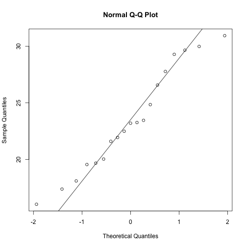
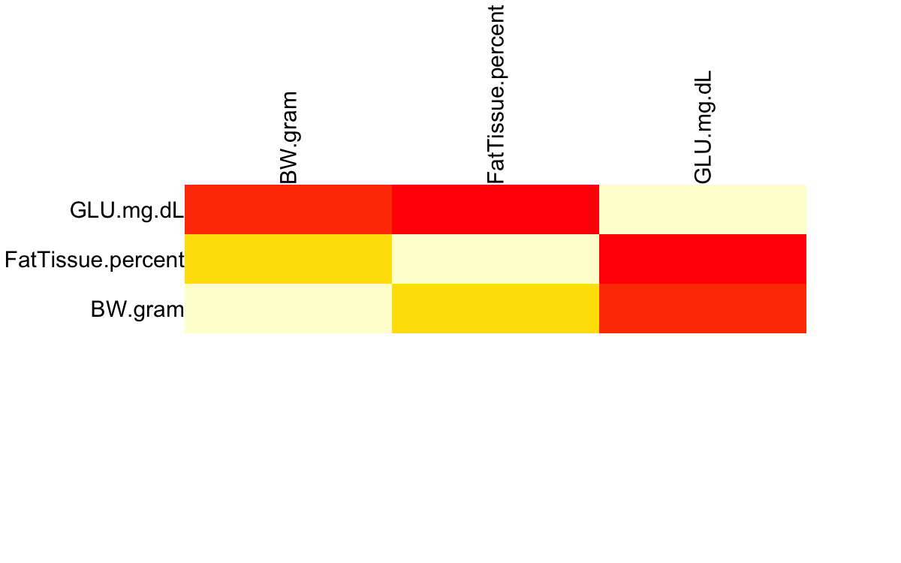
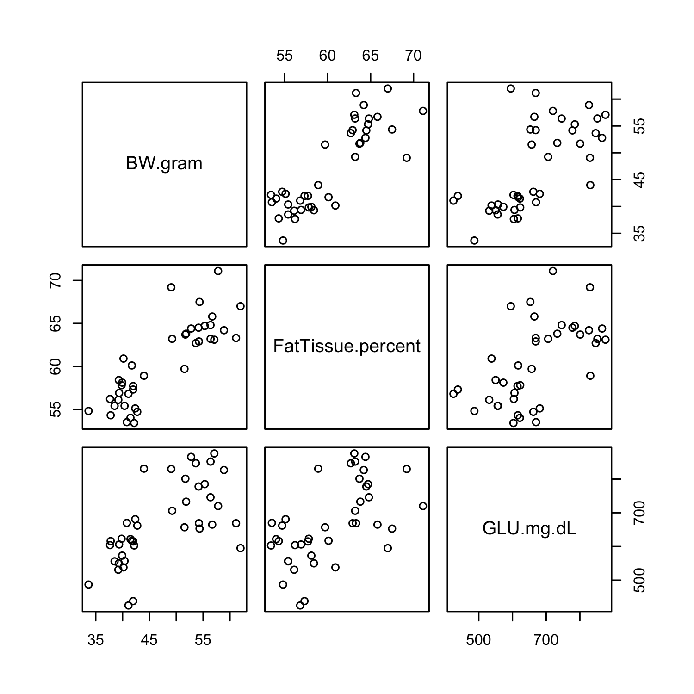
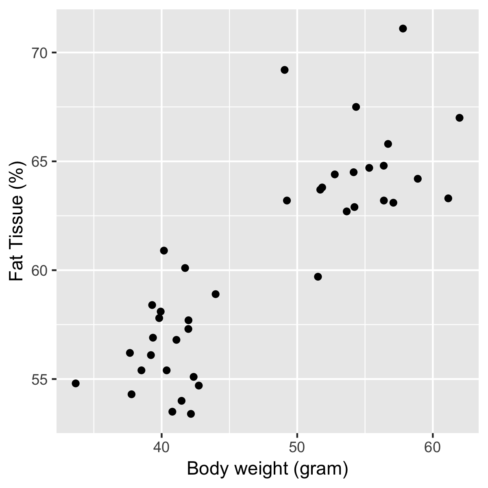
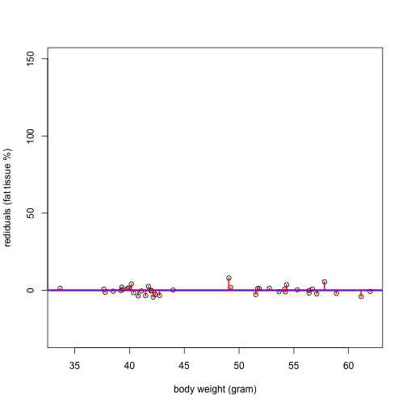

Statistics in R
========================================================
author: MRC London Institute of Medical Sciences (http://bioinformatics.lms.mrc.ac.uk)
date: 25/Sep/2018
width: 1440
height: 1100
autosize: true
font-import: <link href='http://fonts.googleapis.com/css?family=Slabo+27px' rel='stylesheet' type='text/css'>
font-family: 'Slabo 27px', serif;
css:style.css

Outline
========================================================

- data summary

- hypothesis testing

- correlation, linear regression and ANOVA

- we only have 1 hour and 45 minutes...

Materials.
========================================================
id: materials

All prerequisites, links to material and slides for this course can be found on github.
* [StatisticsInR](http://mrccsc.github.io/StatisticsInR/)

Or can be downloaded as a zip archive from here.
* [Download zip](https://github.com/mrccsc/StatisticsInR/zipball/master)

Materials. - Presentations, source code and practicals.
========================================================

Once the zip files are unzipped, all presentations are available as HTML slides and pages. Practical sheets will be available in the directories underneath.

* **exercises/**
Practicals as HTML pages.
* **answers/**
Practicals with answers as HTML pages.

Set the Working directory
========================================================

Before running any of the code in the practicals or slides we need to set the working directory to the folder we unarchived.

You may navigate to the unarchived Reproducible-R folder in the Rstudio menu

**Session -> Set Working Directory -> Choose Directory**

or in the console.


```r
setwd("/Users/yfwang27/workfromhome/workshop/StatisticsR_CBW18")
# e.g. setwd("~/Downloads/StatisticsInR/Statistics2016")
```

Case study
========================================================
Start from some data for mouse strain BKS.Cg-Dock7m +/+ Leprdb/J (db/db)

Data Source: Jackson Laboratory


Save excel file as csv file
========================================================


We don't need a pretty excel file for the csv format
========================================================


Load data
========================================================


```r
> alldata<-read.csv(file="data/mouse_BW_Fat_Glu_info.csv")
```

Data summary
========================================================

- data type

- spread of data

- shape of data

- distribution


Data type
========================================================

data type

- continuous

eg. blood pressure, body weight, height ...

- discrete

eg. gender, hair colour, RNA-seq read count...


Recap some basic R functions (1/7)
========================================================
- **str()**, **head()**, **dim()**, **colnames()** and **summary()** functions
- more details please see [Reproducible R course](http://mrccsc.github.io/Reproducible-R/)

-- [Data types in R](http://mrccsc.github.io/Reproducible-R/r_course/presentations/slides/introToR_Session1.html#/datatypes)


Recap some basic R functions (2/7)
========================================================

**head()**: See the first 6 lines of an R object

```r
> head(alldata)
```

```
     mouseID Sex Genotype Age ID BW.gram FatTissue.percent GLU.mg.dL
1 F_+/+_16_1   F      +/+  16  1   29.98              20.0       162
2 F_+/+_16_2   F      +/+  16  2   20.03              20.4       170
3 F_+/+_16_3   F      +/+  16  3   21.94              25.2       155
4 F_+/+_16_4   F      +/+  16  4   21.60              20.0       181
5  F_+/+_8_1   F      +/+   8  1   19.55              22.9       135
6  F_+/+_8_2   F      +/+   8  2   17.38              22.0       146
```

Recap some basic R functions (3/7)
========================================================
see the how many rows and columns in "alldata" object

```r
> dim(alldata)
```

```
[1] 74  8
```

see column names of "alldata"

```r
> colnames(alldata)
```

```
[1] "mouseID"           "Sex"               "Genotype"         
[4] "Age"               "ID"                "BW.gram"          
[7] "FatTissue.percent" "GLU.mg.dL"        
```

Recap some basic R functions (4/7)
========================================================

**str()**: Compactly display the internal structure of an R object

Make sure the data format is correct for each column.

```r
> str(alldata)
```

```
'data.frame':	74 obs. of  8 variables:
 $ mouseID          : Factor w/ 74 levels "F_+/+_16_1","F_+/+_16_2",..: 1 2 3 4 5 6 7 8 9 10 ...
 $ Sex              : Factor w/ 2 levels "F","M": 1 1 1 1 1 1 1 1 1 1 ...
 $ Genotype         : Factor w/ 3 levels "+/+","db/+","db/db": 1 1 1 1 1 1 1 1 1 2 ...
 $ Age              : int  16 16 16 16 8 8 8 8 8 16 ...
 $ ID               : int  1 2 3 4 1 2 3 4 5 1 ...
 $ BW.gram          : num  30 20 21.9 21.6 19.6 ...
 $ FatTissue.percent: num  20 20.4 25.2 20 22.9 22 26 25.2 21.5 33.4 ...
 $ GLU.mg.dL        : int  162 170 155 181 135 146 152 153 144 159 ...
```

Recap some basic R functions (5/7)
========================================================


```r
> summary(alldata)
```

```
       mouseID   Sex     Genotype       Age           ID       
 F_+/+_16_1: 1   F:35   +/+  :19   Min.   : 8   Min.   : 1.00  
 F_+/+_16_2: 1   M:39   db/+ :15   1st Qu.: 8   1st Qu.: 2.00  
 F_+/+_16_3: 1          db/db:40   Median :12   Median : 4.00  
 F_+/+_16_4: 1                     Mean   :12   Mean   : 4.23  
 F_+/+_8_1 : 1                     3rd Qu.:16   3rd Qu.: 6.00  
 F_+/+_8_2 : 1                     Max.   :16   Max.   :10.00  
 (Other)   :68                                                 
    BW.gram      FatTissue.percent   GLU.mg.dL    
 Min.   :16.04   Min.   :20.00     Min.   :131.0  
 1st Qu.:26.87   1st Qu.:26.70     1st Qu.:195.8  
 Median :38.15   Median :54.15     Median :509.0  
 Mean   :37.36   Mean   :44.91     Mean   :448.1  
 3rd Qu.:47.80   3rd Qu.:60.70     3rd Qu.:664.2  
 Max.   :61.97   Max.   :71.10     Max.   :876.0  
                                                  
```

Recap some basic R functions (6/7)
========================================================


```r
> alldata$Age<-as.factor(alldata$Age)
> summary(alldata)
```

```
       mouseID   Sex     Genotype  Age           ID           BW.gram     
 F_+/+_16_1: 1   F:35   +/+  :19   8 :37   Min.   : 1.00   Min.   :16.04  
 F_+/+_16_2: 1   M:39   db/+ :15   16:37   1st Qu.: 2.00   1st Qu.:26.87  
 F_+/+_16_3: 1          db/db:40           Median : 4.00   Median :38.15  
 F_+/+_16_4: 1                             Mean   : 4.23   Mean   :37.36  
 F_+/+_8_1 : 1                             3rd Qu.: 6.00   3rd Qu.:47.80  
 F_+/+_8_2 : 1                             Max.   :10.00   Max.   :61.97  
 (Other)   :68                                                            
 FatTissue.percent   GLU.mg.dL    
 Min.   :20.00     Min.   :131.0  
 1st Qu.:26.70     1st Qu.:195.8  
 Median :54.15     Median :509.0  
 Mean   :44.91     Mean   :448.1  
 3rd Qu.:60.70     3rd Qu.:664.2  
 Max.   :71.10     Max.   :876.0  
                                  
```

Recap some basic R functions (7/7)
========================================================

**ftable()**: Create ‘flat’ contingency tables

```r
ftable(alldata[,c("Age","Genotype")])
```

```
    Genotype +/+ db/+ db/db
Age                        
8             10    7    20
16             9    8    20
```

Spread of data - working with plots (boxplot)
========================================================

```r
> library(ggplot2)
> ggplot(alldata, aes(x=Genotype, y=BW.gram, fill=Age)) + geom_boxplot()
```


Shape of data - working with plots 2 (Violin plot)
========================================================

```r
> library(ggplot2)
> ggplot(alldata, aes(x=Genotype, y=BW.gram, fill=Age)) + geom_violin(position=position_dodge(width = 0.5)) +geom_boxplot(width=.1, outlier.colour=NA,position=position_dodge(width = 0.5))
```


Spread of data - use body weight from WT mice (1/4)
========================================================

- working with plots
- more details please see [Reproducible R course](http://mrccsc.github.io/Reproducible-R/)

--[Plotting in R](http://mrccsc.github.io/Reproducible-R/r_course/presentations/slides/introToR_Session1.html#/plotting)


```r
> WT_data<-alldata[alldata$Genotype=="+/+",]
> WT_data$BW.gram
```

```
 [1] 29.98 20.03 21.94 21.60 19.55 17.38 19.67 18.10 16.04 27.77 30.93
[12] 29.28 26.57 29.65 22.49 23.45 24.84 23.20 23.26
```

Spread of data - useful functions (2/4)
========================================================

**min()**, **max()**, **median()**, **range()** and **quantile()** functions

```r
> min.BW.gram<-min(WT_data$BW.gram)
> max.BW.gram<-max(WT_data$BW.gram)
> median.BW.gram<-median(WT_data$BW.gram)
> mean.BW.gram<-mean(WT_data$BW.gram)
> c(min.BW.gram, max.BW.gram, median.BW.gram, mean.BW.gram)
```

```
[1] 16.04000 30.93000 23.20000 23.45947
```

```r
> range(WT_data$BW.gram)
```

```
[1] 16.04 30.93
```

```r
> quantile(WT_data$BW.gram)
```

```
   0%   25%   50%   75%  100% 
16.04 19.85 23.20 27.17 30.93 
```

Spread of data - work with plots (3/4)
========================================================
Left: 40%

Boxplot


***

```r
> c(min.BW.gram, max.BW.gram)
```

```
[1] 16.04 30.93
```

```r
> c(median.BW.gram, mean.BW.gram)
```

```
[1] 23.20000 23.45947
```

```r
> quantile(WT_data$BW.gram)[c(2,4)]
```

```
  25%   75% 
19.85 27.17 
```

Spread of data -  work with plots (4/4)
========================================================
**summary()**

```r
> summary(WT_data$BW.gram)
```

```
   Min. 1st Qu.  Median    Mean 3rd Qu.    Max. 
  16.04   19.85   23.20   23.46   27.17   30.93 
```
**range()**: show the minimum and maximum

```r
> range(WT_data$BW.gram)
```

```
[1] 16.04 30.93
```
**IQR()**: show the interquartile range, i.e. 3rd quartile - 1st quartile

```r
> IQR(WT_data$BW.gram)
```

```
[1] 7.32
```


Spread of data - more about boxplot (optional 1/3)
========================================================

Scatter plot: plot the WT mice's Body Weight against index


```r
> plot(WT_data$BW.gram,ylab="Body Weight (gram)")
```


Spread of data - work with plots (optional 2/3)
========================================================
sort the data from min to max


***

start to see something here...


Spread of data - work with plots (optional 3/3)
========================================================


Data shape - histogram (1/4)
========================================================


```r
> hist(WT_data$BW.gram,breaks=10)
```


Data shape - histogram (2/4)
========================================================


```r
> hist(WT_data$BW.gram,breaks=10,freq = F)
> lines(density(WT_data$BW.gram),col="red")
```


Data shape - histogram (3/4)
========================================================


Data shape - violin plot (4/4)
========================================================
Left: 40%


***


Spread of data - Variance and Standard deviation (1/3)
========================================================

$$
  \begin{aligned}
  \overline x  = \frac{{\displaystyle\sum_{i=1}^n}x_i}n \\
  \\ \\
  \text{Variance} = \sigma^2 = \frac{{\displaystyle\sum_{i=1}^n}(\left|x_i-\overline x\right|)^2}{n-1} \\
  \\ \\
  \text{Standard deviation} = \sigma =\sqrt{\text{Variance}} \\
  \\ \\
  \end{aligned}
$$

```r
> var.BW.gram<-sum((WT_data$BW.gram-mean.BW.gram)^2)/(nrow(WT_data)-1)
> sd.BW.gram<-sqrt(var.BW.gram)
> c(var.BW.gram, sd.BW.gram)
```

```
[1] 20.53558  4.53162
```

Spread of data - var() and sd() function (2/3)
========================================================

```r
> var(WT_data$BW.gram)
```

```
[1] 20.53558
```

```r
> sd(WT_data$BW.gram)
```

```
[1] 4.53162
```

More about SD and Variance (3/3)
========================================================
- we use the SD more often because it has the same units as the data BUT, if you know one, then you automatically know the other as well.

- in many analysis, variances are used more often, i.e. F-test

Hypothesis testing and ANOVA
========================================================

- SD (standard deviation) and SE (standard error; standard error of sample mean)

- Confidence Interval (CI)

- Hypothesis testing

 -- parametric test:e.g. t-test

 -- non-parametric test: e.g. Wilcoxon test; chi-square test and Fisher's exact test

- Analysis of Variance (ANOVA)


Statistical tests
========================================================

On top of descriptive statistics, R has several statistical tests covering a range of problems and data types.

Some common tests include:
- var.test() - Comparing 2 variances (Fisher's F test)
- t.test() - Comparing 2 sample means with normal errors (Student's t-test)
- wilcox.test() - Comparing 2 means with non-normal errors (Wilcoxon's rank test)
- fisher.test() - Testing for independence of 2 variables in a contingency table (Fisher's exact test)


Hypothesis testing for mean - t-test (1/8)
========================================================

**t.test()**

*one-sample t-test*

```r
t.test(groupA,mu=something)
```
*independent t-test*

We are going to discuss this case here.

```r
t.test(groupA,groupB,paired=FALSE)
```
*paired t-test*

```r
t.test(Patients_before_treatment,Patients_after_treatment,paired=TRUE)
```

Hypothesis testing for mean - Load data (2/8)
========================================================

Use the WT dataset as example: Is the body weight of WT in Age 8 weeks and Age 16 weeks different. For the purpose of this session, let's assume the mouse body weight is normally distributed in WT 8 weeks and WT 16 weeks.


```r
WT_data<-alldata[alldata$Genotype=="+/+",]
boxplot(BW.gram~Age,data=WT_data)
```


Independent t-test example - Calculating variance (3/8)
========================================================
What is the difference in variances between WT Age 8 weeks and WT Age 16 weeks?

F test

$$F= \frac{S^2_x}{S^2_y}
\\
S^2_x:\text{ sample varience for group x}
\\
S^2_y:\text{ sample varience for gorup y}
\\\\
\text{degrees of freedom for the numerator}=n_x-1
\\
\text{degrees of freedom for the denominator}=n_y-1
$$


Calculating F test with R (4/8)
========================================================

We can test for any differences in variances between WT 8 weeks and WT 16 weeks with an F-test using the var.test() function.

$$H_0:\sigma_{WT_8w}^{2}= \sigma_{WT_16w}^{2}
\\
H_a:\sigma_{WT_8w}^{2}\neq \sigma_{WT_16w}^{2}$$


```r
WT_8w_data<-WT_data[WT_data$Age=="8" ,]
WT_16w_data<-WT_data[WT_data$Age=="16" ,]
var.test(WT_8w_data$BW.gram,WT_16w_data$BW.gram)
```

```

	F test to compare two variances

data:  WT_8w_data$BW.gram and WT_16w_data$BW.gram
F = 0.53289, num df = 9, denom df = 8, p-value = 0.3673
alternative hypothesis: true ratio of variances is not equal to 1
95 percent confidence interval:
 0.1223004 2.1858962
sample estimates:
ratio of variances 
         0.5328912 
```

R objects (s3 and s4) (5/8)
========================================================
Left:30% The data type holding the result var.test() is a little more complex than the data types we have looked.

In R, special objects (S3 or S4 objects) can be created which have methods associated to them. The result from var.test is an object of class htest.

Since we have not come across this before, in order to discover its structure we can use the str() function with the object of interest as the argument.

```r
result <- var.test(WT_8w_data$BW.gram,WT_16w_data$BW.gram)
str(result)
```

```
List of 9
 $ statistic  : Named num 0.533
  ..- attr(*, "names")= chr "F"
 $ parameter  : Named int [1:2] 9 8
  ..- attr(*, "names")= chr [1:2] "num df" "denom df"
 $ p.value    : num 0.367
 $ conf.int   : num [1:2] 0.122 2.186
  ..- attr(*, "conf.level")= num 0.95
 $ estimate   : Named num 0.533
  ..- attr(*, "names")= chr "ratio of variances"
 $ null.value : Named num 1
  ..- attr(*, "names")= chr "ratio of variances"
 $ alternative: chr "two.sided"
 $ method     : chr "F test to compare two variances"
 $ data.name  : chr "WT_8w_data$BW.gram and WT_16w_data$BW.gram"
 - attr(*, "class")= chr "htest"
```


R objects (s3 and s4) (6/8)
========================================================
Now we know the structure and class of the htest object we can access the slots containing information we want just as with a named list.

The p-value

```r
result$p.value
```

```
[1] 0.3673436
```
The statistic

```r
result$statistic
```

```
        F 
0.5328912 
```
The data used in function call

```r
result$data.name
```

```
[1] "WT_8w_data$BW.gram and WT_16w_data$BW.gram"
```

Independent t-test (7/8)
========================================================
We have ascertained that Ration1 and Ration2 have similar variances. We can therefore perform a standard t-test to assess the significance of differences between these groups.

$$H_0:\mu_{WT_{8w}}= \mu_{WT_{16w}}
\\
H_a:\mu_{WT_{8w}}\neq \mu_{WT_{16w}}$$


```r
test_res <- t.test(WT_8w_data$BW.gram,WT_16w_data$BW.gram,alternative ="two.sided", var.equal = T)
test_res
```

```

	Two Sample t-test

data:  WT_8w_data$BW.gram and WT_16w_data$BW.gram
t = -3.3985, df = 17, p-value = 0.003419
alternative hypothesis: true difference in means is not equal to 0
95 percent confidence interval:
 -9.106749 -2.130584
sample estimates:
mean of x mean of y 
 20.79800  26.41667 
```

T-test example - Specifying a formula (8/8)
========================================================
The same result to that shown could be achieved by specifying a formula for the comparison. Here we wish to compare 8 weeks versus 16 weeks so we could simply specify the formula and the data to be used.


```r
result_formula <- t.test(BW.gram~Age,WT_data,alternative ="two.sided", var.equal = T)
result_formula
```

```

	Two Sample t-test

data:  BW.gram by Age
t = -3.3985, df = 17, p-value = 0.003419
alternative hypothesis: true difference in means is not equal to 0
95 percent confidence interval:
 -9.106749 -2.130584
sample estimates:
 mean in group 8 mean in group 16 
        20.79800         26.41667 
```

Non-parametric test
========================================================
  
  Non-parametric statistical hypothesis test is a test that is not based on probability distribution for the dependant variable. 

It doesn't repuire the dependent varible to be normally distributed.

**wilcox.test()**

Wilcoxon Signed-Rank Test is one of the Non-parametric statistical hypothesis tests. It is a good alternative to t-tests without assuming the dependent variables to follow the normal distribution.

t-test and Wilcoxon test alternatives
========================================================

**t.test()**

*one-sample t-test*

```r
t.test(groupA,mu=something)
```
*independent t-test*

```r
t.test(groupA,groupB,paired=FALSE)
```
*paired t-test*

```r
t.test(groupA,groupB,paired=TRUE)
```
***
**wilcox.test()**

*one-sample Wilcoxon: Signed-Rank Test*

```r
wilcox.test(groupA,mu=something)
```
*Wilcoxon Rank Sum Test: Mann-Whitney U*

```r
wilcox.test(groupA,groupB,paired=FALSE)
```
*paired Wilcoxon:Signed-Rank Test*

```r
wilcox.test(groupA,groupB,paired=TRUE)
```

Wilcoxon test - wilcox.test()
========================================================

Wilcoxon Signed-Rank Test is one of the Non-parametric statistical hypothesis tests. It is a good alternative to t-tests without assuming them to follow the normal distribution.

$$H_0: \text{median}_{a}- \text{median}_{b} = 0
\\
H_a: \text{median}_{a}- \text{median}_{b}\neq 0$$

Back to our mouse dataset
========================================================

Is there body weight different between WT and KO mice?


```r
WT_dbdb_data<-alldata[alldata$Genotype!="db/+",]
WT_dbdb_data<-droplevels(WT_dbdb_data)
boxplot(BW.gram~Genotype,data=WT_dbdb_data)
```


Wilcoxon test
========================================================
**qqnorm()** and **qqline()**

Check normal distribution with normal quantile plots for WT data


```r
WT4wilcox<-WT_dbdb_data[WT_dbdb_data$Genotype=="+/+",]

qqnorm(WT4wilcox$BW.gram)
qqline(WT4wilcox$BW.gram)
```


```r
shapiro.test(WT4wilcox$BW.gram)
```

```

	Shapiro-Wilk normality test

data:  WT4wilcox$BW.gram
W = 0.95302, p-value = 0.4441
```

Wilcoxon test
========================================================
**qqnorm()** and **qqline()**

Check normal distribution with normal quantile plots for db/db data


```r
KO4wilcox<-WT_dbdb_data[WT_dbdb_data$Genotype=="db/db",]
qqnorm(KO4wilcox$BW.gram)
qqline(KO4wilcox$BW.gram)
```


```r
shapiro.test(KO4wilcox$BW.gram)
```

```

	Shapiro-Wilk normality test

data:  KO4wilcox$BW.gram
W = 0.90465, p-value = 0.002618
```

Wilcoxon test (Mann-Whitney U)
========================================================
**wilcox.test()**


```r
wilcox.test(WT4wilcox$BW.gram,KO4wilcox$BW.gram, paired=F)
```

```

	Wilcoxon rank sum test

data:  WT4wilcox$BW.gram and KO4wilcox$BW.gram
W = 0, p-value = 1.431e-15
alternative hypothesis: true location shift is not equal to 0
```

fisher.test()
========================================================

Given two gene lists, tests the significance of their overlap in comparison with a genomic background.

$$H_0:\text{ the odds ratio is no larger than 1}
\\
H_a:\text{ the odds ratio is larger than 1 }$$

Assuming there are 20,000 genes in the mouse genome, we have gene list A (300 genes) and B (50 genes). The number of overlap genes between list A and B is 5. Is the overlap between the two list significant?

fisher.test()
========================================================
create a contigency table


```r
> cmatrix<-matrix(c(5,40,295,19960),byrow=T,ncol=2,dimnames=list(c("In.B","Not.In.B"),c("In.A","Not.In.A")))
> cmatrix
```

```
         In.A Not.In.A
In.B        5       40
Not.In.B  295    19960
```

fisher.test()
========================================================
**fisher.test()**


```r
fisher.test(cmatrix)
```

```

	Fisher's Exact Test for Count Data

data:  cmatrix
p-value = 0.0005133
alternative hypothesis: true odds ratio is not equal to 1
95 percent confidence interval:
  2.585939 21.637276
sample estimates:
odds ratio 
  8.454877 
```

  
ANOVA (1/5)
========================================================
  
  Compute analysis of variance (or deviance), a.k.a. ANOVA, for one or more fitted model objects.

ANOVA is a statistical method that uses F-test to test

$$H_0:\mu_{1}= \mu_{2}=... \mu_{k}$$
  
  by comparing the variability between groups to the variability within groups
  
Assume that 

(1) all samples are independent and have >2 categorical groups; 

(2) dependent variable is continuous

(3) data of each group is normally distributed

(4) homogeneneity of variances

ANOVA (2/5)
========================================================

```r
boxplot(BW.gram~Genotype,data=alldata)
```


ANOVA - use the lm() function (3/5)
========================================================

```r
lmPG<-lm(formula = BW.gram ~ Genotype,data = alldata)
lmPG
```

```

Call:
lm(formula = BW.gram ~ Genotype, data = alldata)

Coefficients:
  (Intercept)   Genotypedb/+  Genotypedb/db  
       23.459          5.131         23.796  
```

ANOVA - use the anova() function (4/5)
========================================================

```r
anova_PG<-anova(lmPG)
anova_PG
```

```
Analysis of Variance Table

Response: BW.gram
          Df Sum Sq Mean Sq F value    Pr(>F)    
Genotype   2 8741.8  4370.9  101.48 < 2.2e-16 ***
Residuals 71 3058.0    43.1                      
---
Signif. codes:  0 '***' 0.001 '**' 0.01 '*' 0.05 '.' 0.1 ' ' 1
```

ANOVA - post-hoc analysis (5/5)
========================================================
**TukeyHSD** - Test which of the groups have different means


```r
TukeyHSD(aov(lmPG))
```

```
  Tukey multiple comparisons of means
    95% family-wise confidence level

Fit: aov(formula = lmPG)

$Genotype
                diff        lwr      upr     p adj
db/+-+/+    5.131193 -0.2950406 10.55743 0.0676741
db/db-+/+  23.796276 19.4190332 28.17352 0.0000000
db/db-db/+ 18.665083 13.9085869 23.42158 0.0000000
```

Correlation (1/6)
=========================================================

A common task in statistical analysis is to investigate the linear relationship between pairs of numeric vectors.

This can be done by identifying the correlation between numeric vectors using the **cor()** function in R.

In this example we use **cor()** to identify the Pearson correlation between two variables.  The **method** argument may be set to make use of different correlation methods.

- Perfectly posively correlated vectors will return 1
- Perfectly negatively correlated vectors will return -1
- Vectors showing no or little linear correlation will be close to 0.


Correlation between vectors (2/6)
=========================================================


```r
> x <- rnorm(100,10,2)
> z <- rnorm(100,10,2)
> y <- x
> cor(x,y) #
```

```
[1] 1
```

```r
> cor(x,-y)
```

```
[1] -1
```

```r
> cor(x,z)
```

```
[1] 0.2333653
```
***


Correlation example (3/6)
=========================================================

Example of our mouse data. We would like to see whether there is a relationship between body weight and the percentage of fat tissue in the WT mice.


```r
> KO_data<-alldata[alldata$Genotype=="db/db",]
> head(KO_data)
```

```
         mouseID Sex Genotype Age ID BW.gram FatTissue.percent GLU.mg.dL
16  F_db/db_16_1   F    db/db  16  1   57.09              63.1       876
17 F_db/db_16_10   F    db/db  16 10   61.14              63.3       669
18  F_db/db_16_2   F    db/db  16  2   49.07              69.2       830
19  F_db/db_16_3   F    db/db  16  3   55.31              64.7       785
20  F_db/db_16_4   F    db/db  16  4   56.39              63.2       852
21  F_db/db_16_5   F    db/db  16  5   49.24              63.2       706
```

```r
> cor(KO_data$BW.gram,KO_data$FatTissue.percent)
```

```
[1] 0.8436125
```
***


Correlation over a matrix (4/6)
=========================================================
left: 70%
Often we wish to apply correlation analysis to all columns or rows in a matrix in a pair-wise manner. To do this in R, we can simply pass the **cor()** function a single argument of the numeric matrix of interest. The **cor()** function will then perform all pair-wise correlations between columns.

- subset iris dataset

```r
> mouse4cor<-KO_data[,c(6:8)]; 
```

Correlation over a matrix (5/6)
=========================================================

```r
> cor(mouse4cor)
```

```
                    BW.gram FatTissue.percent GLU.mg.dL
BW.gram           1.0000000         0.8436125 0.6511112
FatTissue.percent 0.8436125         1.0000000 0.5751244
GLU.mg.dL         0.6511112         0.5751244 1.0000000
```


Correlation (6/6)
========================================================

```r
> pairs(mouse4cor)
```


Linear regression (1/23)
=========================================================

We have seen how we can find the linear correlation between two sets of variables using **cor()** function.

R also provides a comprehensive set of tools for regression analysis including the well used linear modeling function **lm()**

- least square method

*minimize the vertical distance between the fitted line and data points* 


Linear regression (2/23)
=========================================================
left: 70%
We use KO mouse dataset as example and see whether we can use mouse body weight to predict the percentage of fat tissue.

```r
> KO_data<-alldata[alldata$Genotype=="db/db",]
> head(KO_data)
```

```
         mouseID Sex Genotype Age ID BW.gram FatTissue.percent GLU.mg.dL
16  F_db/db_16_1   F    db/db  16  1   57.09              63.1       876
17 F_db/db_16_10   F    db/db  16 10   61.14              63.3       669
18  F_db/db_16_2   F    db/db  16  2   49.07              69.2       830
19  F_db/db_16_3   F    db/db  16  3   55.31              64.7       785
20  F_db/db_16_4   F    db/db  16  4   56.39              63.2       852
21  F_db/db_16_5   F    db/db  16  5   49.24              63.2       706
```
***


Linear regression (3/23)
=========================================================
The **lm()** function fits a linear regression to your data and provides useful information on the generated fit.

In the example below we fit a linear model using  **lm()** on the *KO_data* dataset with *FatTissue.percent* (Y) as the dependent variable and *BW.gram* (X) as the explanatory variable.

```r
> lmResult<-lm(formula = FatTissue.percent ~ BW.gram, data = KO_data)
> lmResult
```

```

Call:
lm(formula = FatTissue.percent ~ BW.gram, data = KO_data)

Coefficients:
(Intercept)      BW.gram  
    36.6140       0.5026  
```


Interpret output of lm() (4/23)
=========================================================

As we have seen, printing the model result provides the intercept and slope of line.
To get some more information on the model we can use the **summary()** function

```r
> summary(lmResult)
```

```

Call:
lm(formula = FatTissue.percent ~ BW.gram, data = KO_data)

Residuals:
    Min      1Q  Median      3Q     Max 
-4.4038 -1.5671 -0.0821  1.1951  7.9231 

Coefficients:
            Estimate Std. Error t value Pr(>|t|)    
(Intercept)  36.6140     2.4861  14.727  < 2e-16 ***
BW.gram       0.5026     0.0519   9.685 8.25e-12 ***
---
Signif. codes:  0 '***' 0.001 '**' 0.01 '*' 0.05 '.' 0.1 ' ' 1

Residual standard error: 2.583 on 38 degrees of freedom
Multiple R-squared:  0.7117,	Adjusted R-squared:  0.7041 
F-statistic:  93.8 on 1 and 38 DF,  p-value: 8.247e-12
```

Interpret output of lm() - coefficients (5/23)
=========================================================
left: 70%

```r
> lmResult$coefficients
```

```
(Intercept)     BW.gram 
 36.6140076   0.5026053 
```
From the **$coefficients** of object *lmResult*, we know the equation for the best fit is

**$$Y = 36.6140076 + 0.5026053 *X$$**

**$$f(x)  = b_0 + b_1x$$**

$$b_0\text{: the value of f(x) when x =0}$$


```r
# the Intercept 36.6140076 is the expected percentage of fat tissue of a 0 body weight
# not interesting to any biological questions
```

$$b_1\text{: the amount of f(x) will change when x changes 1 unit}$$


```r
# For every gram increased in the mice body weight, we expect 0.50 (%) increased in the Fat tissue
```
***


More about coefficients (6/23)
=========================================================

Predict the percentage of fat tissue with the body weight information.

If we have 3 KO mice with weight = 40, 55 and 66 grams, how do we predict their percentage of fat tissue?


Use the information from the *$coefficients*

```r
> new_mouse_bw<-c(40,55,66)
> beta0<-lmResult$coefficients[1]
> beta1<-lmResult$coefficients[2]
> 
> predicted_new_fat<-beta0+beta1*new_mouse_bw
> predicted_new_fat
```

```
[1] 56.71822 64.25730 69.78596
```

Or use the *predict()*

```r
new_mouse_bw_df <- data.frame(BW.gram=c(40,55,66))
cleaver_predicted_fat<-predict(lmResult,new_mouse_bw_df)
cleaver_predicted_fat
```

```
       1        2        3 
56.71822 64.25730 69.78596 
```


Interpret output of lm() - residuals (7/23)
=========================================================

The **residuals** are the difference between the predicted and actual values.
To retrieve the residuals we can access the slot or use the **resid()** function.


```r
> summary(resid(lmResult))
```

```
    Min.  1st Qu.   Median     Mean  3rd Qu.     Max. 
-4.40385 -1.56712 -0.08214  0.00000  1.19506  7.92315 
```

```r
> summary(lmResult$residual)
```

```
    Min.  1st Qu.   Median     Mean  3rd Qu.     Max. 
-4.40385 -1.56712 -0.08214  0.00000  1.19506  7.92315 
```
Ideally you would want your residuals to be normally distributed around 0.

$$
E[e_{i}]=0
$$

More about residuals (8/23)
=========================================================

Plot the residuals


```r
plot(KO_data$BW.gram,KO_data$FatTissue.percent,ylim=c(0,120),
     ylab="Fat tissue (%)",xlab="body weight (gram)")
abline(lmResult,col="blueviolet",lwd=3, lty=1)
```


More about residuals (9/23)
=========================================================

Residual is the vertical distance between the observed data and the regression line. It has the same unit as the dependent variable.


More about residuals (10/23)
=========================================================

SSE shows the residual variability

It shows the variability that cannot be explained by the regression model


***
$$
Error_i = y_i - \hat{y_i}
\\
y_i\text{: the observed weight of ith kid}
\\
\hat{y_i}\text{: the predicted weight of ith kid}
\\
Error_i^2  = (y_i - \hat{y_i})^2
\\
\text{- sum of the square of the residuals (SSE)}
\\
SSE  = \sum_{i=1}^{n}(y_i-\hat{y_i})^2
$$


More about residuals (11/23)
=========================================================

Plot the residuals against the independent variable (X), i.e. the height. It makes the residual accessment easiler by eyes.


```r
plot(KO_data$BW.gram,lmResult$residual,ylim=c(-30,30),
     ylab="residuals (fat tissue %)",xlab="body weight (gram)")
abline(h=0,col="blueviolet",lwd=3, lty=1)
```



More about residuals (12/23)
=========================================================

Plot the residuals against the independent variable (X), i.e. the height. 


More about residuals (13/23)
=========================================================

Plot the residuals against the independent variable (X)



***
$$
Error_i = y_i - \hat{y_i}
\\

Error_i^2  = (y_i - \hat{y_i})^2
\\
\text{- sum of the square of the residuals (SSE)}
\\
SSE  = \sum_{i=1}^{n}(y_i-\hat{y_i})^2
$$


Interpret output of lm() - R-squared (14/23)
=========================================================

- The **R-squared** value represents the proportion of variability in the response variable that is explained by the explanatory variable.

- A high **R-squared** here indicates that the line fits closely to the data.


```r
> summary(lmResult)$r.squared
```

```
[1] 0.711682
```


More about R-squared (15/23)
=========================================================

- Question: How would you describe (or summarize) kid's weight when the **height information is absence**? Which information you would use to predict a new child's weight?


```r
> KO_data$FatTissue.percent
```

```
 [1] 63.1 63.3 69.2 64.7 63.2 63.2 71.1 62.7 67.0 63.7 57.7 54.8 56.8 53.5
[15] 60.1 55.1 55.4 57.8 56.2 57.3 59.7 64.2 62.9 58.9 63.8 64.8 67.5 65.8
[29] 64.5 64.4 56.1 54.3 56.9 58.1 53.4 60.9 58.4 54.7 54.0 55.4
```

More about R-squared (16/23)
=========================================================

- Question: How would you describe (or summarize) kid's weight when the **height information is absence**? Which information you would use to predict a new child's weight?

- mean might be a good choice


```r
> mean(KO_data$FatTissue.percent)
```

```
[1] 60.365
```

- If we have a new child, we could assume that the kid's weight is around 38.384 pounds.

More about R-squared (17/23)
=========================================================

- Question: How would you describe (or summarize) kid's weight when the **height information is absence**? Which information you would use to predict a new child's weight?

- mean might be a good choice


More about R-squared - TSS (18/23)
=========================================================


***
Residuals from the mean: assuming the independent variable (X), i.e. height in our case, does not exist

$$
TSS=\text{Total Sum of Squares}=\sum_{i=1}^n(y_i-\overline y)^2
$$


More about  about R-squared (19/23)
=========================================================

Residuals from the mean: assuming the independent variable (X), i.e. height in our case, does not exist


- Total Sum of Squares (TSS)

$$
  \begin{aligned}
  TSS  = \sum_{i=1}^{n}(y_i-\overline y)^2
  \end{aligned}
$$

***

Residuals from the model


- Sum of the square of the residuals (SSE)
$$
SSE  = \sum_{i=1}^{n}(y_i-\hat{y_i})^2
$$

More about R-squared (20/23)
=========================================================



More about R-squared - Calculating R-squared (21/23)
=========================================================

The fraction of variability in the independent variable (Y; or the *weight* in this example) that can be explained by the explanatory variable (X; or the *height* in this example).

$$
TSS=\text{Total Sum of Squares}=\sum_{i=1}^n(y_i-\overline y)^2
\\
SSE=\text{Sum of the Square of the residuals}=\sum_{i=1}^n(y_i-\hat{y})^2
$$


```r
> SSE<-sum(resid(lm(FatTissue.percent~BW.gram,data=KO_data))^2)
> TSS<-sum(resid(lm(FatTissue.percent~1,data=KO_data))^2)
> R_square<-1-(SSE/TSS)
> R_square
```

```
[1] 0.711682
```

```r
> summary(lmResult)$r.squared
```

```
[1] 0.711682
```


Interpret output of lm() - F-statistics (22/23)
=========================================================

The R-squared shows the fraction of the total variability that is explained by the linear relationship with the explanatory variable. However, it does not provide a formal hypothesis test for this relationship. 

The F-test results from linear models also provides a measure of significance for a variable not being relevant


```r
> summary(lmResult)$fstatistic
```

```
   value    numdf    dendf 
93.79893  1.00000 38.00000 
```

More about F-statistics - Calculating F-stat (23/23)
=========================================================

$$
F=\frac{MSM}{MSE}=\frac{\text{mean of the explained variance}}{\text{mean of the unexplained variance}}=\frac{({\displaystyle\frac{SSM}1})}{({\displaystyle\frac{SSE}{n-2}})}
$$


```r
> n=nrow(KO_data)
> SSM <- sum((predict(lmResult) - mean(KO_data$FatTissue.percent))^2)
> MSE <-sum(lmResult$residuals^2)/(n-2)
> 
> MSM <-SSM/1
> 
> MSM/MSE
```

```
[1] 93.79893
```

```r
> summary(lmResult)$fstatistic
```

```
   value    numdf    dendf 
93.79893  1.00000 38.00000 
```
