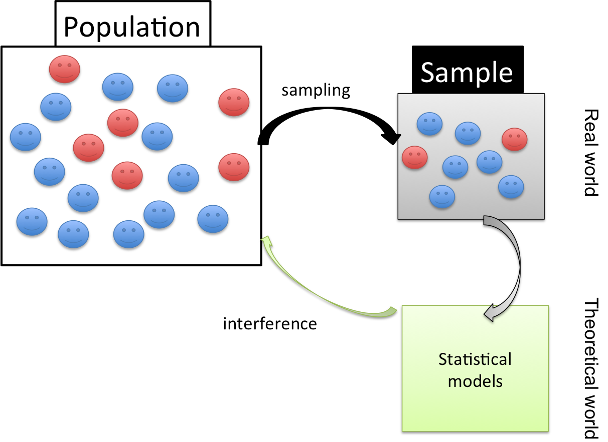
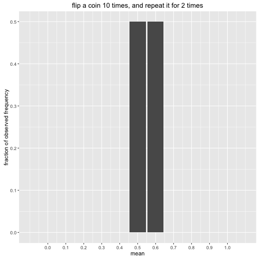
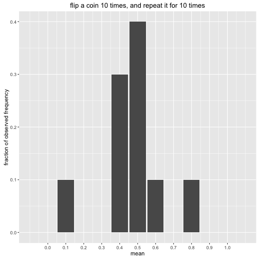
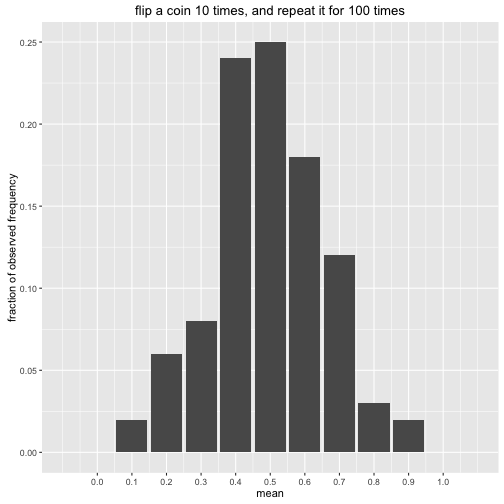
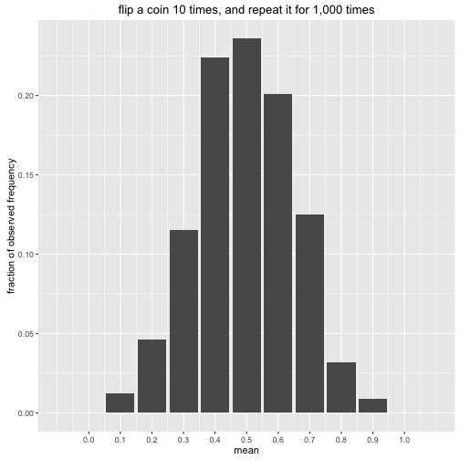
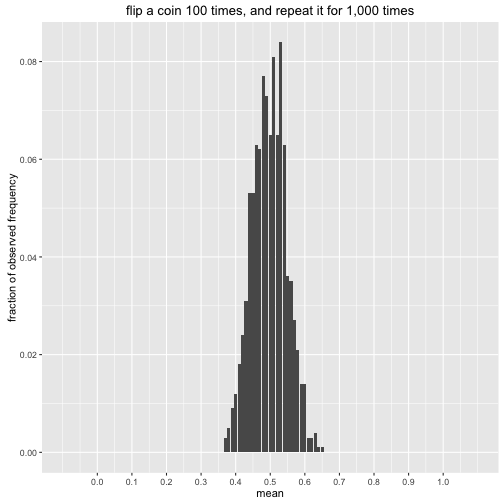
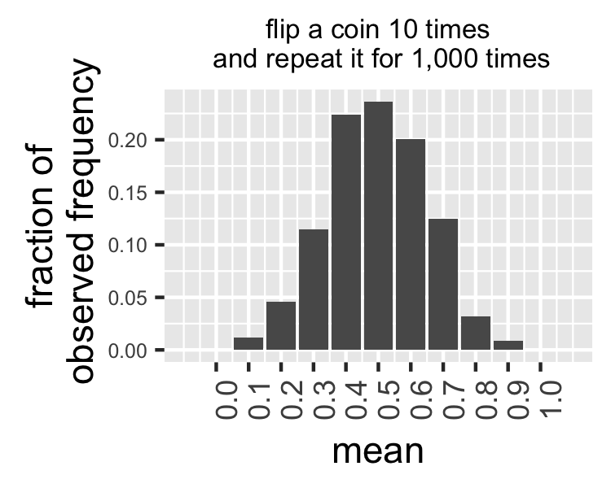
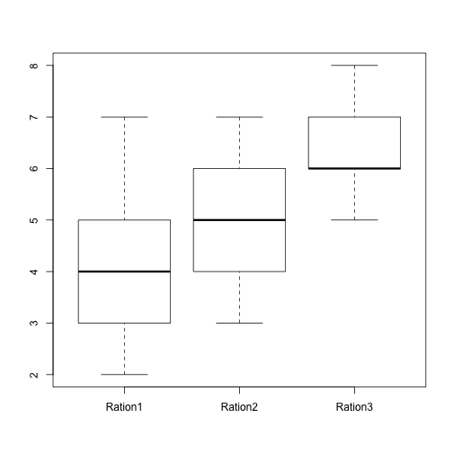
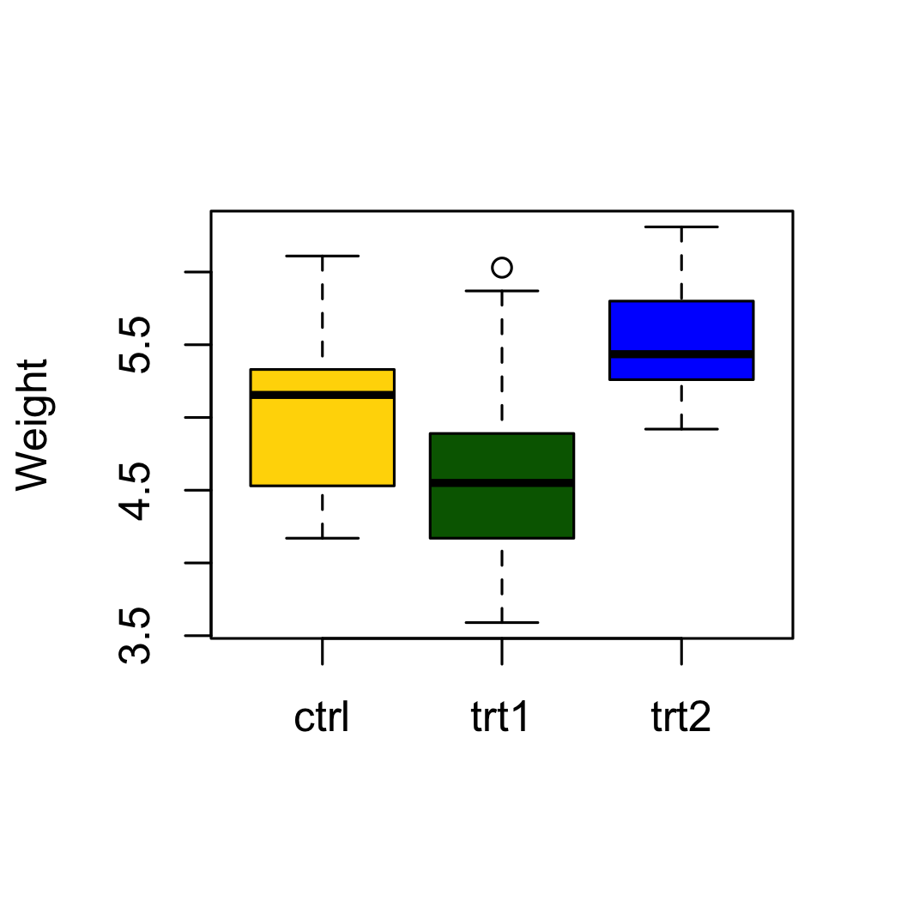
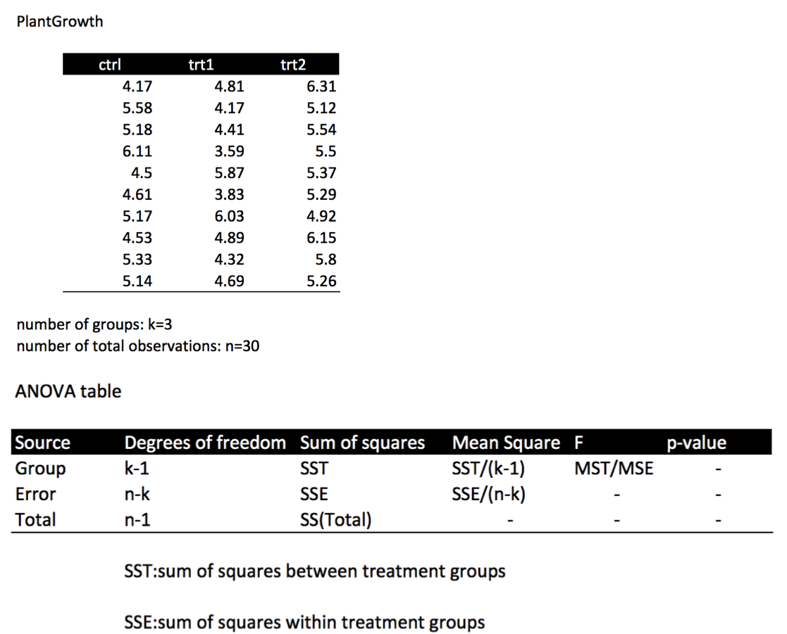

Session2: Hypothesis Testing and ANOVA
========================================================
author: MRC Clinical Sciences Centre (http://mrccsc.github.io/)
date: 14/Nov/2016
width: 1440
height: 1100
autosize: true
font-import: <link href='http://fonts.googleapis.com/css?family=Slabo+27px' rel='stylesheet' type='text/css'>
font-family: 'Slabo 27px', serif;
css:style.css

Hypothesis testing and ANOVA
========================================================

- SD (standard deviation) and SE (standard error; standard error of sample mean)

- Confidence Interval (CI)

- Hypothesis testing

 -- parametric test:e.g. t-test

 -- non-parametric test: e.g. Wilcoxon test; chi-square test and Fisher's exact test

- Analysis of Variance (ANOVA)


SD and SE (1/8)
========================================================




SD and SE - sampling distribution for the mean (2/8)
========================================================

If we flip a fair coin 10 times, what is the mean of this experiment?

```r
> # always do set.seed() before the random sampling
> set.seed(123)
> # observation number, number of trials and probability of success on each trial
> no.observation=10;
> test1<-rbinom(no.observation,1,0.5)
> test1
```

```
 [1] 0 1 0 1 1 0 1 1 1 0
```

```r
> showmean<-mean(test1)
> showmean
```

```
[1] 0.6
```
***

If we flip a fair coin 10 times ***again***, what is the mean of this experiment?

```r
> test2<-rbinom(no.observation,1,0.5)
> showmean2<-mean(test2)
> showmean2
```

```
[1] 0.5
```


SD and SE - sampling distribution for the mean (3/8)
========================================================

If we flip a fair coin 10 times, what is the mean of this experiment?

```r
> # always do set.seed() before the random sampling
> set.seed(123)
> # observation number, number of trials and probability of success on each trial
> no.observation=10;
> test1<-rbinom(no.observation,1,0.5)
> test1
```

```
 [1] 0 1 0 1 1 0 1 1 1 0
```

```r
> showmean<-mean(test1)
> showmean
```

```
[1] 0.6
```
***

If we flip a fair coin 10 times ***again***, what is the mean of this experiment?

```r
> test2<-rbinom(no.observation,1,0.5)
> showmean2<-mean(test2)
> showmean2
```

```
[1] 0.5
```


SD and SE - sampling distribution for the mean (4/8)
========================================================

What will happen if we repeat this experiment for 10 times, rather than only 2 times

```r
> set.seed(123)
> no.experiment=10;no.observation<-10
> mat4plot<-matrix(nrow=no.experiment,ncol=1);
> for (i in 1:no.experiment){
+   mat4plot[i,1]<-mean(rbinom(no.observation,1,0.5))
+ }
```



SD and SE - Central limit theorem (5/8)
========================================================

Flip a coin for 10 times, and repeat it for 100 times


***

Flip a coin for 10 times, and repeat it for 1,000 times



SD and SE - Central limit theorem (C.L.T.) (6/8)
========================================================

Flip a coin for 10 times, and repeat it for 1,000 times


***
$$\text{the sample mean }\overline X\text{ follows an approximate normal distribution}
  \\
  \overline X\approx Normal\left(\mu,\dfrac{\sigma^2}{n}\right)$$

mean of the sampling distribution of the mean

  $$E(\overline X)=\mu_{\overline X}=\mu$$

variance of the sampling distribution of the mean

$$
  Var(\overline X)=\sigma_{\overline X}^2=\frac{\sigma^2}n \text{or }SE^2=\frac{SD^2}n
  \\ \\
  SE=\frac{SD}{\sqrt n}
  \\
$$

***What will happen if we flip a coin for 100 times and repeat it for 1000 times?***


SD and SE - Central limit theorem (C.L.T.) (7/8)
========================================================

Flip a coin for 10 times, and repeat it for 1,000 times


$$
  SE=\frac{SD}{\sqrt{10}}
$$

***

Flip a coin for 100 times and repeat it for 1,000 times



$$
  SE=\frac{SD}{\sqrt{100}}
$$


SD and SE (8/8)
========================================================

- SE (standard error; standard error of sample mean): shows how accurate the sample mean of your experiment is likely to be

- SD (standard deviation): shows the spread of your data points

- You should not use the SE to replace the SD because they are different information. 

- If you really want to show SE in your result, remember you MUST show the n (sample size) as well so that people can back calculate your SD.


Confidence Interval
========================================================

If we repeatedly flip a coin for 10 times, how confident we are that we will get a sample mean that is close to the population mean.




Confidence Interval for proportions (1/4) [optional material]
========================================================

- $$
\begin{aligned}
  \text{distribution of }\hat{p}:
\end{aligned}
$$

*Known*

$$
  \begin{aligned}
  E(\hat{p}) = p.
  \\
  Var(\hat{p})=\frac{p(1-p)}n.
  \\

  \text{C.L.T.: approximately: }
  \\
  \hat{p}\approx Normal\left(p,\;\frac{p(1-p)}n\right).
\end{aligned}
$$

*So*

- $$
\begin{aligned}
  \frac{ \hat{p}-p}{\sqrt{\displaystyle\frac{p(1-p)}n}}\approx Normal\left(0,\;1\right).
\end{aligned}
$$

***

$$
\begin{aligned}
  P(\left|\frac{\widehat p-p}{\sqrt{\displaystyle\frac{p(1-p)}n}}\right|>1.96)\approx5\%.
  \\
  P(\left|\frac{\widehat p-p}{\sqrt{\displaystyle\frac{p(1-p)}n}}\right|\leq1.96)\approx95\%.
  \\
  P(p-1.96\sqrt{\frac{p(1-p)}n}\leq\widehat p\leq p+1.96\sqrt{\frac{p(1-p)}n})\approx95\%.
\end{aligned}
$$

- $$\text{95% confidence interval for }\hat{p}$$

$$
\begin{aligned}
  \left[\hat p-1.96\sqrt{\frac{p(1-p)}n},\;\hat p+1.96\sqrt{\frac{p(1-p)}n}\right].
\end{aligned}
$$

- $$\text{p is unknown}$$

***$$\text{substitute }p=\hat{p}$$***

***$$\text{or substitute }p=1/2$$***


Confidence Interval for means (2/4) [optional material]
========================================================

- $$
\begin{aligned}
  \text{distribution of }\overline X:
\end{aligned}
$$

*Known*

$$
  \begin{aligned}
  E(\overline X) = \mu = \text{true mean}.
  \\
  Var(\overline X)=\frac{\sigma^2}n.
  \\
  \text{C.L.T.: approximately: }
  \\
  \overline X\approx Normal\left(\mu,\;\frac{\sigma^2}n\right).
\end{aligned}
$$

*So*

- $$
\begin{aligned}
  \frac{\overline X-\mu}{\sqrt{\displaystyle\frac{\sigma^2}n}}\approx Normal\left(0,\;1\right).
\end{aligned}
$$

***

$$
\begin{aligned}
  P(\left|\frac{ \overline X-\mu}{\sqrt{\frac{\sigma^2}n}}\right|\leq1.96)\approx95\%.
  \\

  P\left(\overline X-1.96\sqrt{\frac{\sigma^2}n},\;\overline X+1.96\sqrt{\frac{\sigma^2}n}\right)\approx95\%.
\end{aligned}
$$

- $$\text{95% confidence interval for }\overline X$$

$$
\begin{aligned}
  \left[\overline X-1.96\sqrt{\frac{\sigma^2}n},\;\overline X+1.96\sqrt{\frac{\sigma^2}n}\right].
\end{aligned}
$$

- $$\sigma^2\text{ is unknown}$$

*Known*

$$E(S^2)=\sigma^2$$

***$$\text{substitue }\sigma^2=S^2$$***


Confidence Interval for means (3/4) [optional material]
========================================================

after substitution, rather than having

$$ \frac{\overline X-\mu}{\sqrt{\displaystyle\frac{S^2}n}}\approx Normal\left(0,\;1\right).$$

we have

$$ \frac{\overline X-\mu}{\sqrt{\displaystyle\frac{S^2}n}}\approx t_{n-1}.$$

$$t_{n-1}:\text{t distribution with n-1 degrees of freedom}.$$


Confidence Interval (CI) (4/4)
========================================================

*Confidence Interval for proportions*

$$
\begin{aligned}
  100(1-\alpha)\%\text{ CI for }\hat{p}:
  \\\\
  \hat{p}\pm z_\frac\alpha2\sqrt{\frac{p(1-p)}n}.
\end{aligned}

$$

*Confidence Interval for means*

$$
\begin{aligned}
  100(1-\alpha)\%\text{ CI for }\overline X:
  \\\\
  \overline X\pm t_\frac\alpha2\frac S{\sqrt n}.
\end{aligned}
\\
$$

*for example*

$$
\text{95% CI for }\overline X\text{ is the probability that the confidence interval contains the population mean}

$$

Statistical tests
========================================================

On top of descriptive statistics, R has several statistical tests covering a range of problems and data types.

Some common tests include:
- binom.test() - Performs an exact test of a simple null hypothesis about the probability of success in a Bernoulli experiment.
- var.test() - Comparing 2 variances (Fisher's F test)
- t.test() - Comparing 2 sample means with normal errors (Student's t-test)
- wilcox.test() - Comparing 2 means with non-normal errors (Wilcoxon's rank test)
- fisher.test() - Testing for independence of 2 variables in a contingency table (Fisher's exact test)


Hypothesis testing
========================================================

**H0**

Null hypothesis is assumed true and unless there is statitical evidence to reject it in favor of an alternative hypothesis.

**Ha or H1**

Alternative hypothesis is hoped or expected to be true instead of the null hypothesis.

**P Value**

If **H0** is true, what is the probability of finding the observed, or more extreme, results.


Hypothesis testing for propotions
========================================================

example: EU referendum result 2016

[data/EU-referendum-result-data.csv]

Did more than 50% percent of the voting UK population support remaining in the EU?

$$
H_0:\text{ Vote for remain equal to 50%; p=0.5}
\\
H_a:\text{ Vote for remain is less than 50%; p<0.5 }
$$


```r
vote.leave=17410742

vote.remain=16141241

total.vote=vote.leave+vote.remain

total.vote
```

```
[1] 33551983
```

```r
vote.leave/total.vote
```

```
[1] 0.5189184
```

CI for the vote for leave
========================================================

The vote for leave is 0.5189184, is it confident? Calculate the 95% CI


```r
alpha.vote=0.05;

phat.vote<-vote.leave/total.vote;

z.vote<-qnorm(alpha.vote/2,
              mean=0,sd=1,
              lower.tail = F)

ME.vote<-z.vote*sqrt(phat.vote*(1-phat.vote)/total.vote)

CI.vote<-phat.vote + c(-ME.vote, ME.vote)

CI.vote
```

```
[1] 0.5187494 0.5190875
```
***

Use the *binom.confint()* from **binom** package


```r
#install.packages("binom")
library("binom")
```


```r
binom.confint(vote.leave, total.vote, conf.level = 0.95, methods = "asymptotic")
```

```
      method        x        n      mean     lower     upper
1 asymptotic 17410742 33551983 0.5189184 0.5187494 0.5190875
```

Hypothesis testing for propotions - one sided
========================================================
Left: 60%

$$H_0:\text{ Vote for remain equal to 50%; p=0.5}
\\
H_a:\text{ Vote for remain is less than 50%; p<0.5 }$$

$$
p:\text{ true ratio for the vote for remain is unknow}
\\
\hat{p}:\text{ estimated ratio for the vote for remain}
\\
\\
\frac{\hat{p}-p}{\sqrt{\displaystyle\frac{p(1-p)}n}}\approx N(0,1)
\\
\text{p-value: under }H_0\text{ ,}
\\
\text{the probability of observing such extreme value }\hat{p}-p
\\
P\left(\hat p-p\leq0.4810816-0.5\right)
\\
=P\left(Normal\left(0,1\right)\leq\frac{0.4810816-0.5}{\sqrt{\displaystyle\frac{0.5(1-0.5)}{33551983}}}\right)
$$
***

```r
> alpha.vote=0.05;
> p.vote=0.5;
> phat.vote<-vote.remain/total.vote;
> d=phat.vote-p.vote
> pnorm(d/sqrt(p.vote*(1-p.vote)/total.vote))
```

```
[1] 0
```

Hypothesis testing for propotions
========================================================

$$H_0:\text{ Vote for remain is equal to 50%}
\\
H_a:\text{ Vote for remain is < 50%}$$

```r
binom.test(vote.remain, total.vote, p=0.5, alternative = "less")
```

```

	Exact binomial test

data:  vote.remain and total.vote
number of successes = 16141000, number of trials = 33552000,
p-value < 2.2e-16
alternative hypothesis: true probability of success is less than 0.5
95 percent confidence interval:
 0.0000000 0.4812235
sample estimates:
probability of success 
             0.4810816 
```
***

$$H_0:\text{ Vote for remain is equal to 50%}
\\
H_a:\text{ Vote for remain is not equal to 50%}$$

```r
binom.test(vote.remain, total.vote, p=0.5, alternative = "two.sided")
```

```

	Exact binomial test

data:  vote.remain and total.vote
number of successes = 16141000, number of trials = 33552000,
p-value < 2.2e-16
alternative hypothesis: true probability of success is not equal to 0.5
95 percent confidence interval:
 0.4809125 0.4812507
sample estimates:
probability of success 
             0.4810816 
```


Hypothesis testing for mean - t-test (1/12)
========================================================

**t.test()**

*one-sample t-test*

```r
t.test(groupA,mu=something)
```
*independent t-test*

We are going to discuss this case here.

```r
t.test(groupA,groupB,paired=FALSE)
```
*paired t-test*

```r
t.test(Patients_before_treatment,Patients_after_treatment,paired=TRUE)
```

Hypothesis testing for mean - Load data (2/12)
========================================================

Use the *chicken* dataset as example: weight gain of chickens fed 3 different rations


```r
#install.packages("UsingR")
library("UsingR")
data(chicken)
head(chicken)
```

```
  Ration1 Ration2 Ration3
1       4       3       6
2       4       4       7
3       7       5       7
4       3       4       7
5       2       6       6
6       5       4       8
```

```r
dim(chicken)
```

```
[1] 13  3
```
***



Independent t-test example - Calculating variance (3/12)
========================================================
What is the difference in variances between Ration1 and Ration2?

F test

$$F= \frac{S^2_x}{S^2_y}
\\
S^2_x:\text{ sample varience for group x}
\\
S^2_y:\text{ sample varience for gorup y}
\\\\
\text{degrees of freedom for the numerator}=n_x-1
\\
\text{degrees of freedom for the denominator}=n_y-1
$$


Calculating variance with R - var() function (4/12)
========================================================

First we can specify the columns of interest using $ and calculate their variance using var().

```r
var(chicken$Ration1)
```

```
[1] 2.141026
```

```r
var(chicken$Ration2)
```

```
[1] 1.166667
```

```r
var(chicken$Ration3)
```

```
[1] 0.7564103
```

Calculating F-ratio (5/12)
========================================================


```r
Fratio<-var(chicken$Ration1)/var(chicken$Ration2)
Fratio
```

```
[1] 1.835165
```

```r
df_Ration1<-13-1
df_Ration2<-13-1
```

Calculate the F critical values for F distribution with *⍺=0.05*, *df1=df_Ration1*, and *df2=df_Ration2*

```r
critical_values<-qf(c(0.025,0.975),df1=df_Ration1, df2=df_Ration2)
critical_values
```

```
[1] 0.3051314 3.2772771
```

Calculate the Confidence interval


```r
conf.level<-0.95
BETA<- (1-conf.level)/2
c(Fratio/qf(1 - BETA, df1=df_Ration1, df2=df_Ration2), Fratio/qf(BETA, df1=df_Ration1, df2=df_Ration2))
```

```
[1] 0.5599663 6.0143437
```


Calculating F test with R (6/12)
========================================================

Now we can test for any differences in variances between Ration1 and Ration2 with an F-test using the var.test() function.

$$H_0:\sigma_{Ration1}^{2}= \sigma_{Ration2}^{2}
\\
H_a:\sigma_{Ration1}^{2}\neq \sigma_{Ration2}^{2}$$


```r
var.test(chicken$Ration1,chicken$Ration2,conf.level = 0.95)
```

```

	F test to compare two variances

data:  chicken$Ration1 and chicken$Ration2
F = 1.8352, num df = 12, denom df = 12, p-value = 0.3066
alternative hypothesis: true ratio of variances is not equal to 1
95 percent confidence interval:
 0.5599663 6.0143437
sample estimates:
ratio of variances 
          1.835165 
```

R objects (s3 and s4) (7/12)
========================================================
Left:30% The data type holding the result var.test() is a little more complex than the data types we have looked.

In R, special objects (S3 or S4 objects) can be created which have methods associated to them. The result from var.test is an object of class htest.

Since we have not come across this before, in order to discover its structure we can use the str() function with the object of interest as the argument.

```r
result <- var.test(chicken$Ration1,chicken$Ration2)
str(result)
```

```
List of 9
 $ statistic  : Named num 1.84
  ..- attr(*, "names")= chr "F"
 $ parameter  : Named int [1:2] 12 12
  ..- attr(*, "names")= chr [1:2] "num df" "denom df"
 $ p.value    : num 0.307
 $ conf.int   : atomic [1:2] 0.56 6.01
  ..- attr(*, "conf.level")= num 0.95
 $ estimate   : Named num 1.84
  ..- attr(*, "names")= chr "ratio of variances"
 $ null.value : Named num 1
  ..- attr(*, "names")= chr "ratio of variances"
 $ alternative: chr "two.sided"
 $ method     : chr "F test to compare two variances"
 $ data.name  : chr "chicken$Ration1 and chicken$Ration2"
 - attr(*, "class")= chr "htest"
```


R objects (s3 and s4) (8/12)
========================================================
Now we know the structure and class of the htest object we can access the slots containing information we want just as with a named list.

The p-value

```r
result$p.value
```

```
[1] 0.3066159
```
The statistic

```r
result$statistic
```

```
       F 
1.835165 
```
The data used in function call

```r
result$data.name
```

```
[1] "chicken$Ration1 and chicken$Ration2"
```

Independent t-test (9/12)
========================================================
We have ascertained that Ration1 and Ration2 have similar variances. We can therefore perform a standard t-test to assess the significance of differences between these groups.

$$H_0:\mu_{Ration1}= \mu_{Ration2}
\\
H_a:\mu_{Ration1}\neq \mu_{Ration2}$$


```r
test_res <- t.test(chicken$Ration1,chicken$Ration2,alternative ="two.sided", var.equal = T)
test_res
```

```

	Two Sample t-test

data:  chicken$Ration1 and chicken$Ration2
t = -1.6775, df = 24, p-value = 0.1064
alternative hypothesis: true difference in means is not equal to 0
95 percent confidence interval:
 -1.8872221  0.1949145
sample estimates:
mean of x mean of y 
 4.153846  5.000000 
```

T-test example - Specifying a formula (11/12)
========================================================
The same result to that shown could be achieved by specifying a formula for the comparison. Here we wish to compare Ration1 versus Ration2 so we could simply specify the formula and the data to be used.

```r
data4formula<-data.frame(weight_gain=c(chicken$Ration1,chicken$Ration2),
                         group=c(rep("Ration1",13),rep("Ration2",13)))
head(data4formula)
```

```
  weight_gain   group
1           4 Ration1
2           4 Ration1
3           7 Ration1
4           3 Ration1
5           2 Ration1
6           5 Ration1
```

```r
summary(data4formula)
```

```
  weight_gain        group   
 Min.   :2.000   Ration1:13  
 1st Qu.:4.000   Ration2:13  
 Median :5.000               
 Mean   :4.577               
 3rd Qu.:5.000               
 Max.   :7.000               
```

T-test example - Specifying a formula (12/12)
========================================================


```r
result_formula <- t.test(weight_gain~group,data4formula,alternative ="two.sided", var.equal = T)
result_formula
```

```

	Two Sample t-test

data:  weight_gain by group
t = -1.6775, df = 24, p-value = 0.1064
alternative hypothesis: true difference in means is not equal to 0
95 percent confidence interval:
 -1.8872221  0.1949145
sample estimates:
mean in group Ration1 mean in group Ration2 
             4.153846              5.000000 
```


ANOVA (1/5)
========================================================

Compute analysis of variance (or deviance), a.k.a. ANOVA, for one or more fitted model objects.

ANOVA is a statistical method that uses F-test to test

$$H_0:\mu_{1}= \mu_{2}=... \mu_{k}$$

by comparing the variability between groups to the variability within groups


ANOVA (2/5)
========================================================

```r
data(PlantGrowth)
summary(PlantGrowth)
```

```
     weight       group   
 Min.   :3.590   ctrl:10  
 1st Qu.:4.550   trt1:10  
 Median :5.155   trt2:10  
 Mean   :5.073            
 3rd Qu.:5.530            
 Max.   :6.310            
```
***


ANOVA (3/5)
========================================================




ANOVA - use the anova() function (4/5)
========================================================

```r
lmPG<-lm(formula = weight ~ group,data = PlantGrowth)
lmPG
```

```

Call:
lm(formula = weight ~ group, data = PlantGrowth)

Coefficients:
(Intercept)    grouptrt1    grouptrt2  
      5.032       -0.371        0.494  
```


```r
anova_PG<-anova(lmPG)
anova_PG
```

```
Analysis of Variance Table

Response: weight
          Df  Sum Sq Mean Sq F value  Pr(>F)  
group      2  3.7663  1.8832  4.8461 0.01591 *
Residuals 27 10.4921  0.3886                  
---
Signif. codes:  0 '***' 0.001 '**' 0.01 '*' 0.05 '.' 0.1 ' ' 1
```

ANOVA - results (5/5)
========================================================
More details in the next session

```r
anova_PG
```

```
Analysis of Variance Table

Response: weight
          Df  Sum Sq Mean Sq F value  Pr(>F)  
group      2  3.7663  1.8832  4.8461 0.01591 *
Residuals 27 10.4921  0.3886                  
---
Signif. codes:  0 '***' 0.001 '**' 0.01 '*' 0.05 '.' 0.1 ' ' 1
```

Non-parametric test
========================================================

Non-parametric statistical hypothesis test is a test that is not based on probability distribution for the dependant variable. 

It doesn't repuired the dependent varible to be normally distributed.

**wilcox.test()**

Wilcoxon Signed-Rank Test is one of the Non-parametric statistical hypothesis tests. It is a good alternative to t-tests without assuming the dependent variables to follow the normal distribution.

t-test and Wilcoxon test alternatives
========================================================

**t.test()**

*one-sample t-test*

```r
t.test(groupA,mu=something)
```
*independent t-test*

```r
t.test(groupA,groupB,paired=FALSE)
```
*paired t-test*

```r
t.test(groupA,groupB,paired=TRUE)
```
***
**wilcox.test()**

*one-sample Wilcoxon: Signed-Rank Test*

```r
wilcox.test(groupA,mu=something)
```
*Wilcoxon Rank Sum Test: Mann-Whitney U*

```r
wilcox.test(groupA,groupB,paired=FALSE)
```
*paired Wilcoxon:Signed-Rank Test*

```r
wilcox.test(groupA,groupB,paired=TRUE)
```

Wilcoxon test
========================================================
**wilcox.test()**

Wilcoxon Signed-Rank Test is one of the Non-parametric statistical hypothesis tests. It is a good alternative to t-tests without assuming them to follow the normal distribution.

$$H_0: \text{median}_{a}- \text{median}_{b} = 0
\\
H_a: \text{median}_{a}- \text{median}_{b}\neq 0$$


```r
a <- c(214, 159, 169, 202, 103, 119, 200, 109, 132, 142, 194, 104, 219, 119, 234)
b <- c(159, 135, 141, 101, 102, 168, 62, 167, 174, 159, 66, 118, 181, 171, 112)

wilcox.test(a,b, paired=TRUE)
```

```

	Wilcoxon signed rank test

data:  a and b
V = 80, p-value = 0.2769
alternative hypothesis: true location shift is not equal to 0
```

fisher.test()
========================================================

Given two gene lists, tests the significance of their overlap in comparison with a genomic background.

$$H_0:\text{ the odds ratio is no larger than 1}
\\
H_a:\text{ the odds ratio is larger than 1 }$$

Assuming there are 20,000 genes in the mouse genome, we have gene list A (300 genes) and B (50 genes). The number of overlap genes between list A and B is 5. Is the overlap between the two list significant?


```r
fmatrix<-matrix(c(5,45,295,19655),byrow=T,ncol=2,dimnames=list(c("In.B","Not.In.B"),c("In.A","Not.In.A")))
fmatrix
```

```
         In.A Not.In.A
In.B        5       45
Not.In.B  295    19655
```

```r
fisher.test(fmatrix)
```

```

	Fisher's Exact Test for Count Data

data:  fmatrix
p-value = 0.0008958
alternative hypothesis: true odds ratio is not equal to 1
95 percent confidence interval:
  2.276483 18.782110
sample estimates:
odds ratio 
   7.40199 
```


Time for an exercise!
========================================================

Exercise on this session can be found [here](exercises/Session2_exercise2.html)


Answers to exercise.
========================================================

Answers can be found [here](answers/Session2_answers2.html)


