Session3: Correlation and Linear Regression
========================================================
author: MRC Clinical Sciences Centre (http://mrccsc.github.io/)
date: 14/Nov/2016
width: 1440
height: 1100
autosize: true
font-import: <link href='http://fonts.googleapis.com/css?family=Slabo+27px' rel='stylesheet' type='text/css'>
font-family: 'Slabo 27px', serif;
css:style.css

Outline
========================================================
- correlation

- linear regression


Correlation (1/6)
=========================================================

A common task in statistical analysis is to investigate the linear relationship between pairs of numeric vectors.

This can be done by identifying the correlation between numeric vectors using the **cor()** function in R.

In this example we use **cor()** to identify the Pearson correlation between two variables.  The **method** argument may be set to make use of different correlation methods.

- Perfectly posively correlated vectors will return 1
- Perfectly negatively correlated vectors will return -1
- Vectors showing no or little linear correlation will be close to 0.


Correlation between vectors (2/6)
=========================================================


```r
> x <- rnorm(100,10,2)
> z <- rnorm(100,10,2)
> y <- x
> cor(x,y) #
```

```
[1] 1
```

```r
> cor(x,-y)
```

```
[1] -1
```

```r
> cor(x,z)
```

```
[1] -0.02935699
```
***
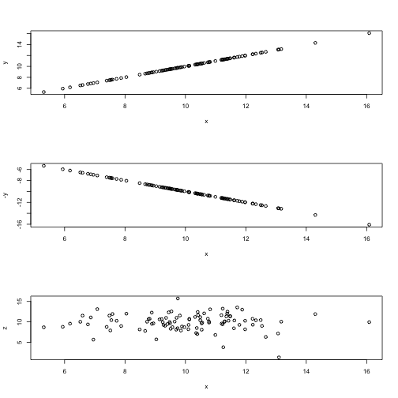

Correlation example (3/6)
=========================================================

Example of blood pressure of 15 males taken by machine and expert. We would like to see whether there is a relationship between machine and expert measured blood pressure.


```r
> #install.packages("UsingR")
> library("UsingR")
> data(blood)
> head(blood)
```

```
  Machine Expert
1      68     72
2      82     84
3      94     89
4     106    100
5      92     97
6      80     88
```

```r
> cor(blood$Machine,blood$Expert)
```

```
[1] 0.9068599
```
***
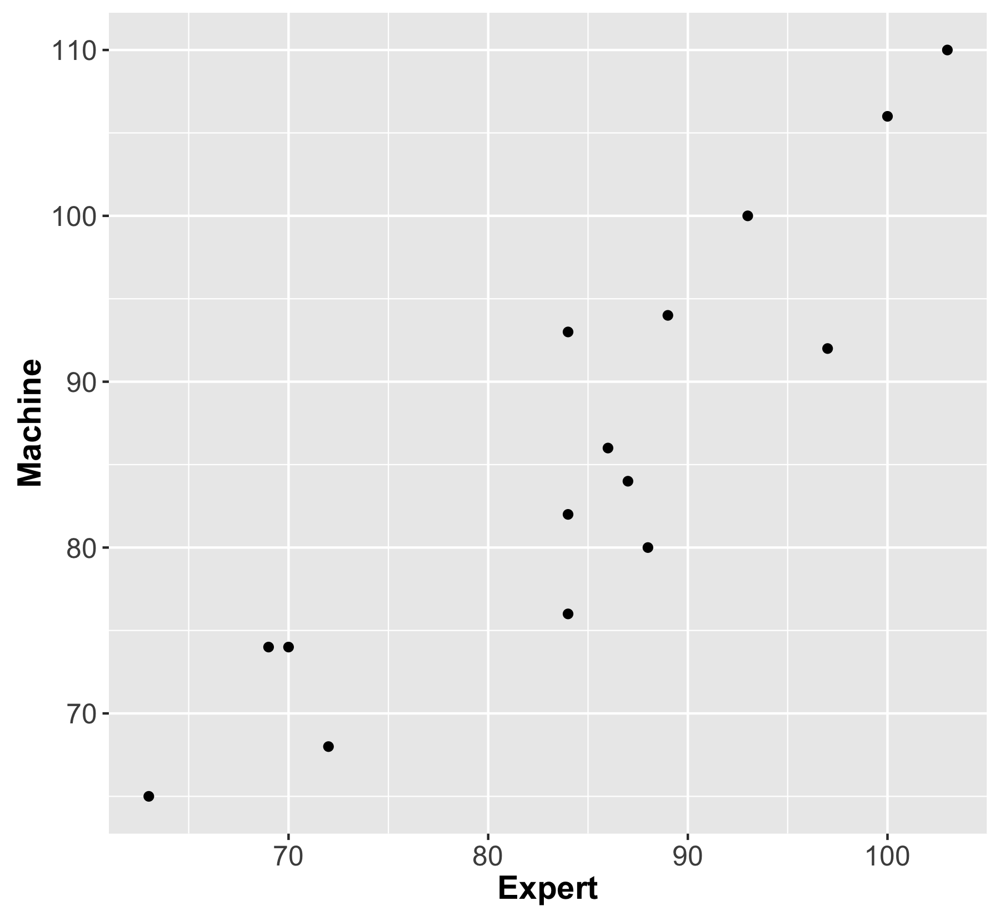

Correlation over a matrix (4/6)
=========================================================
left: 70%
Often we wish to apply correlation analysis to all columns or rows in a matrix in a pair-wise manner. To do this in R, we can simply pass the **cor()** function a single argument of the numeric matrix of interest. The **cor()** function will then perform all pair-wise correlations between columns.

- subset iris dataset

```r
> data(iris)
> head(iris)
```

```
  Sepal.Length Sepal.Width Petal.Length Petal.Width Species
1          5.1         3.5          1.4         0.2  setosa
2          4.9         3.0          1.4         0.2  setosa
3          4.7         3.2          1.3         0.2  setosa
4          4.6         3.1          1.5         0.2  setosa
5          5.0         3.6          1.4         0.2  setosa
6          5.4         3.9          1.7         0.4  setosa
```

```r
> iris4cor<-iris[,c(1:4)]; 
> # or
> # iris4cor<-iris[,-5]
```


Correlation over a matrix (5/6)
=========================================================

```r
> cor(iris4cor)
```

```
             Sepal.Length Sepal.Width Petal.Length Petal.Width
Sepal.Length    1.0000000  -0.1175698    0.8717538   0.8179411
Sepal.Width    -0.1175698   1.0000000   -0.4284401  -0.3661259
Petal.Length    0.8717538  -0.4284401    1.0000000   0.9628654
Petal.Width     0.8179411  -0.3661259    0.9628654   1.0000000
```
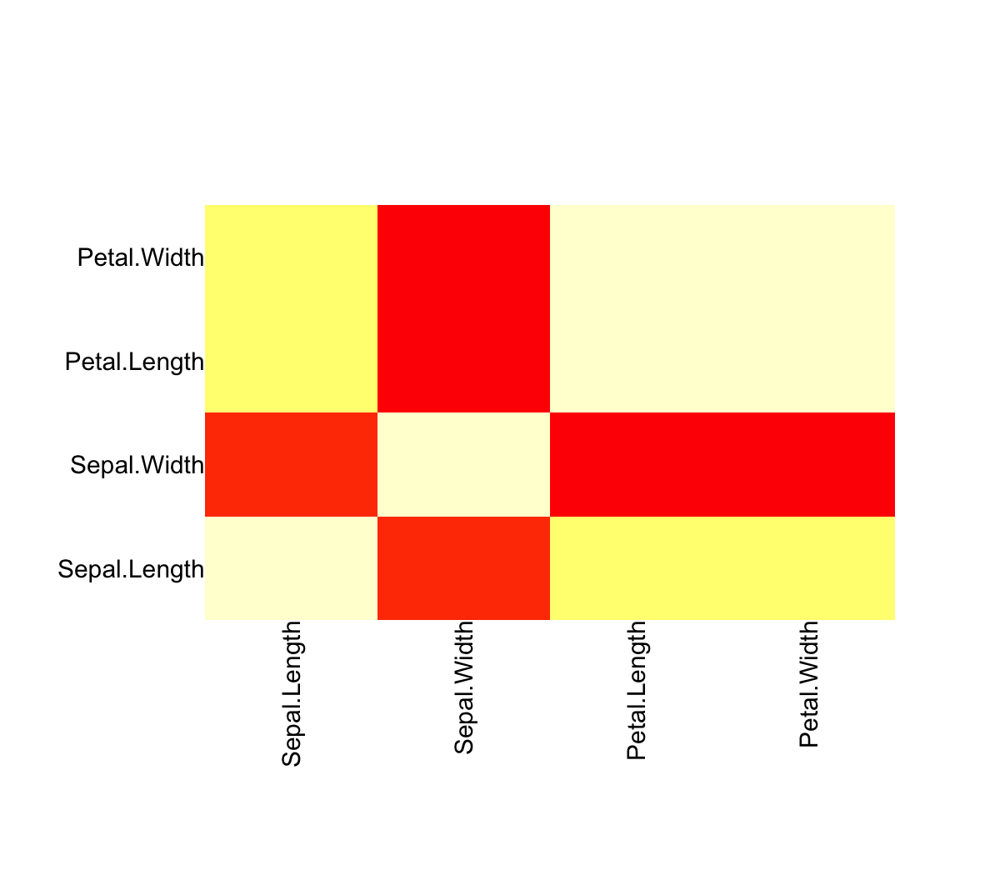

Correlation (6/6)
========================================================

```r
> pairs(iris4cor)
```

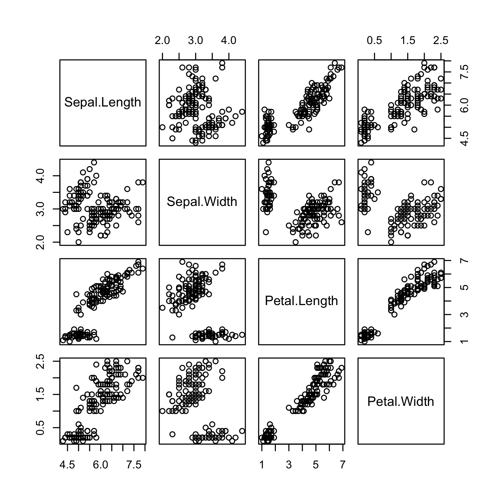


Linear regression (1/23)
=========================================================

We have seen how we can find the linear correlation between two sets of variables using **cor()** function.

R also provides a comprehensive set of tools for regression analysis including the well used linear modeling function **lm()**

- least square method

*minimize the vertical distance between the fitted line and data points* 

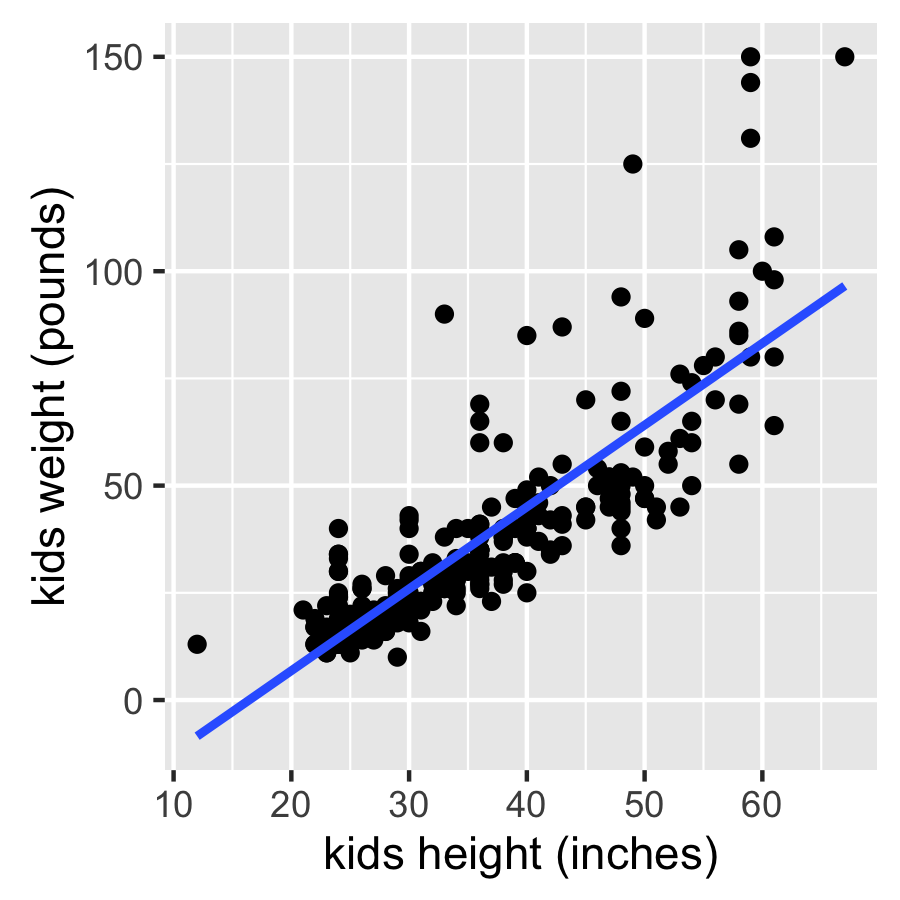


Linear regression (2/23)
=========================================================
left: 70%
We use *kid.weights* dataset as example and see whether we can use kids height to predict kids weight

```r
> #install.packages("UsingR")
> #library("UsingR")
> data(kid.weights)
> str(kid.weights)
```

```
'data.frame':	250 obs. of  4 variables:
 $ age   : num  58 103 87 138 82 52 28 79 107 45 ...
 $ weight: num  38 87 50 98 47 30 24 45 144 24 ...
 $ height: num  38 43 48 61 47 24 29 48 59 24 ...
 $ gender: Factor w/ 2 levels "F","M": 2 2 2 2 1 1 2 1 2 2 ...
```

```r
> # or using head() function
> head(kid.weights)
```

```
  age weight height gender
1  58     38     38      M
2 103     87     43      M
3  87     50     48      M
4 138     98     61      M
5  82     47     47      F
6  52     30     24      F
```
***
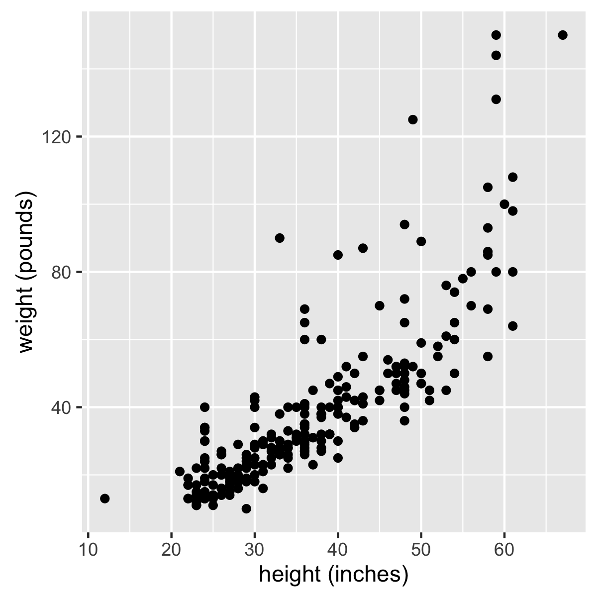


Linear regression (3/23)
=========================================================
The **lm()** function fits a linear regression to your data and provides useful information on the generated fit.

In the example below we fit a linear model using  **lm()** on the *kid.weights* dataset with *weight* (Y) as the dependent variable and *height* (X) as the explanatory variable.

```r
> lmResult<-lm(formula = weight ~ height, data = kid.weights)
> lmResult
```

```

Call:
lm(formula = weight ~ height, data = kid.weights)

Coefficients:
(Intercept)       height  
    -31.342        1.909  
```


Interpret output of lm() (4/23)
=========================================================

As we have seen, printing the model result provides the intercept and slope of line.
To get some more information on the model we can use the **summary()** function

```r
> summary(lmResult)
```

```

Call:
lm(formula = weight ~ height, data = kid.weights)

Residuals:
    Min      1Q  Median      3Q     Max 
-24.837  -7.361  -2.384   3.616  68.708 

Coefficients:
             Estimate Std. Error t value Pr(>|t|)    
(Intercept) -31.34191    3.17493  -9.872   <2e-16 ***
height        1.90904    0.08343  22.882   <2e-16 ***
---
Signif. codes:  0 '***' 0.001 '**' 0.01 '*' 0.05 '.' 0.1 ' ' 1

Residual standard error: 14.09 on 248 degrees of freedom
Multiple R-squared:  0.6786,	Adjusted R-squared:  0.6773 
F-statistic: 523.6 on 1 and 248 DF,  p-value: < 2.2e-16
```

Interpret output of lm() - coefficients (5/23)
=========================================================
left: 70%

```r
> lmResult$coefficients
```

```
(Intercept)      height 
 -31.341912    1.909044 
```
From the **$coefficients** of object *lmResult*, we know the equation for the best fit is

**$$Y = -31.342 + 1.909044 *X$$**

**$$f(x)  = b_0 + b_1x$$**

$$b_0\text{: the value of f(x) when x =0}$$


```r
# the Intercept -31.341912 is the expected weight of a 0 inch height
# not interesting to any biological questions
```

$$b_1\text{: the amount of f(x) will change when x changes 1 unit}$$


```r
# For every inch increased in the kids height, we expect 1.9 pounds increased in the kids weight
```
***


More about coefficients (6/23)
=========================================================

Predict the kid weight with the height information.

If we have 3 kids with height = 23, 40 and 66 inches, how do we predict their weights?


Use the information from the *$coefficients*

```r
> new_kid_height<-c(23,40,66)
> beta0<-lmResult$coefficients[1]
> beta1<-lmResult$coefficients[2]
> 
> predicted_new_kid_weight<-beta0+beta1*new_kid_height
> predicted_new_kid_weight
```

```
[1] 12.56609 45.01984 94.65497
```

Or use the *predict()*

```r
new_kid_height_df <- data.frame(height=c(23,40,66))
cleaver_predicted_kid_weight<-predict(lmResult,new_kid_height_df)
cleaver_predicted_kid_weight
```

```
       1        2        3 
12.56609 45.01984 94.65497 
```


Interpret output of lm() - residuals (7/23)
=========================================================

The **residuals** are the difference between the predicted and actual values.
To retrieve the residuals we can access the slot or use the **resid()** function.


```r
> summary(resid(lmResult))
```

```
   Min. 1st Qu.  Median    Mean 3rd Qu.    Max. 
-24.840  -7.361  -2.384   0.000   3.616  68.710 
```

```r
> summary(lmResult$residual)
```

```
   Min. 1st Qu.  Median    Mean 3rd Qu.    Max. 
-24.840  -7.361  -2.384   0.000   3.616  68.710 
```
Ideally you would want your residuals to be normally distributed around 0.

$$
E[e_{i}]=0
$$

More about residuals (8/23)
=========================================================

Plot the residuals


```r
plot(kid.weights$height,kid.weights$weight,ylim=c(-30,150),
     ylab="weigth (pounds)",xlab="height (inches)")
abline(lmResult,col="blueviolet",lwd=3, lty=1)
```

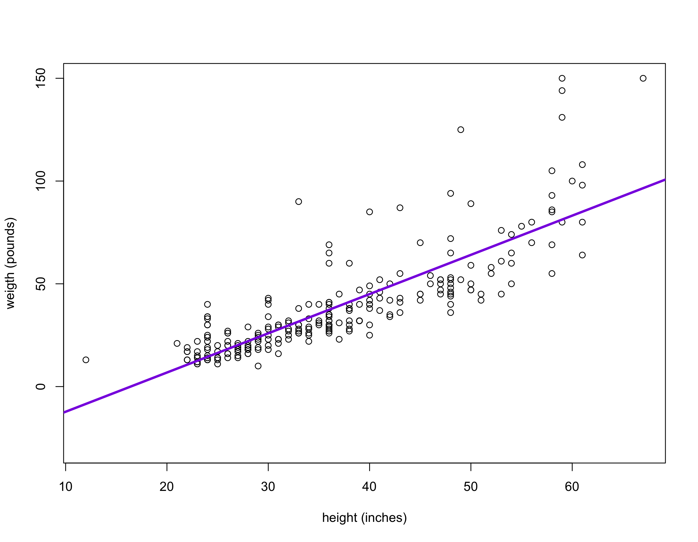

More about residuals (9/23)
=========================================================

Residual is the vertical distance between the observed data and the regression line. It has the same unit as the dependent variable.

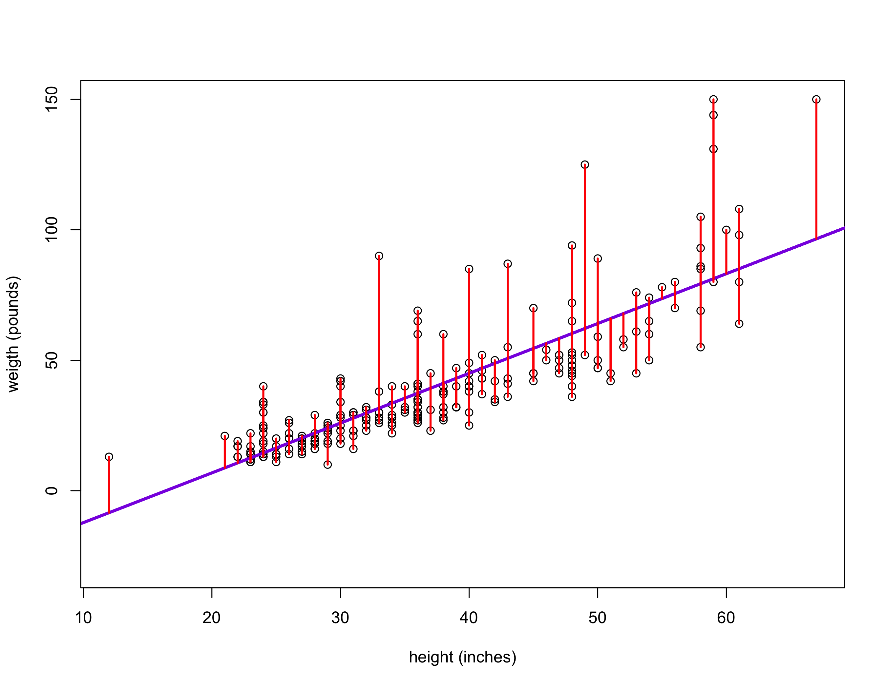

More about residuals (10/23)
=========================================================

SSE shows the residual variability

It shows the variability that cannot be explained by the regression model


***
$$
Error_i = y_i - \hat{y_i}
\\
y_i\text{: the observed weight of ith kid}
\\
\hat{y_i}\text{: the predicted weight of ith kid}
\\
Error_i^2  = (y_i - \hat{y_i})^2
\\
\text{- sum of the square of the residuals (SSE)}
\\
SSE  = \sum_{i=1}^{n}(y_i-\hat{y_i})^2
$$


More about residuals (11/23)
=========================================================

Plot the residuals against the independent variable (X), i.e. the height. It makes the residual accessment easiler by eyes.


```r
plot(kid.weights$height,lmResult$residual,ylim=c(-30,150),
     ylab="residuals (weight pounds)",xlab="height (inches)")
abline(h=0,col="blueviolet",lwd=3, lty=1)
```

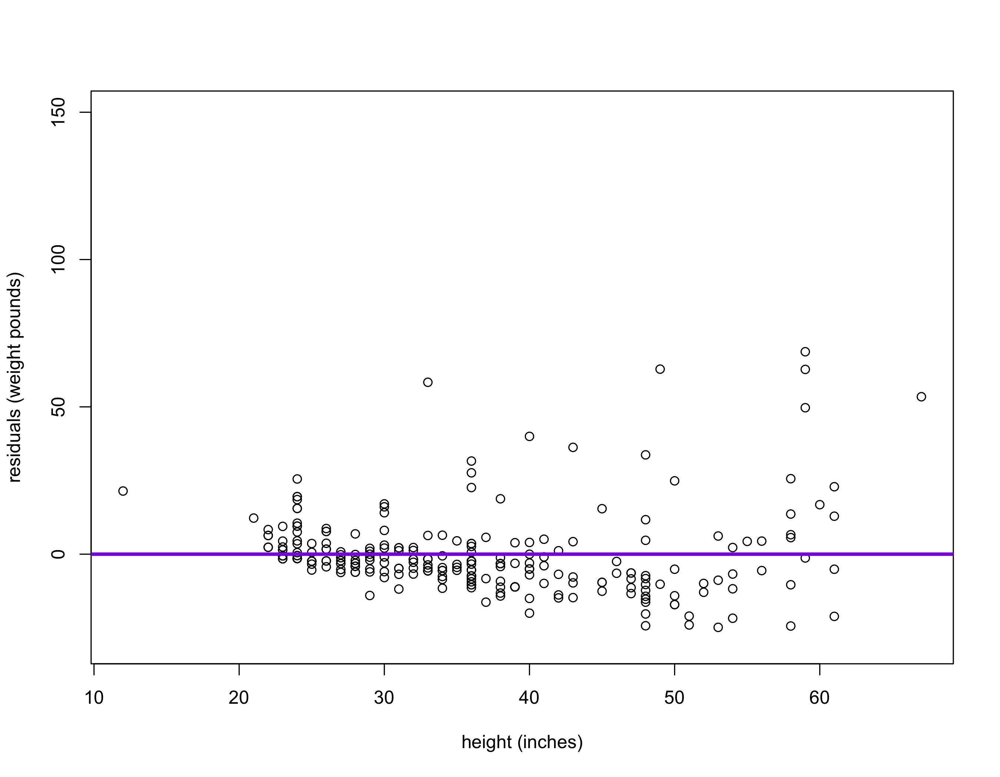

More about residuals (12/23)
=========================================================

Plot the residuals against the independent variable (X), i.e. the height. 

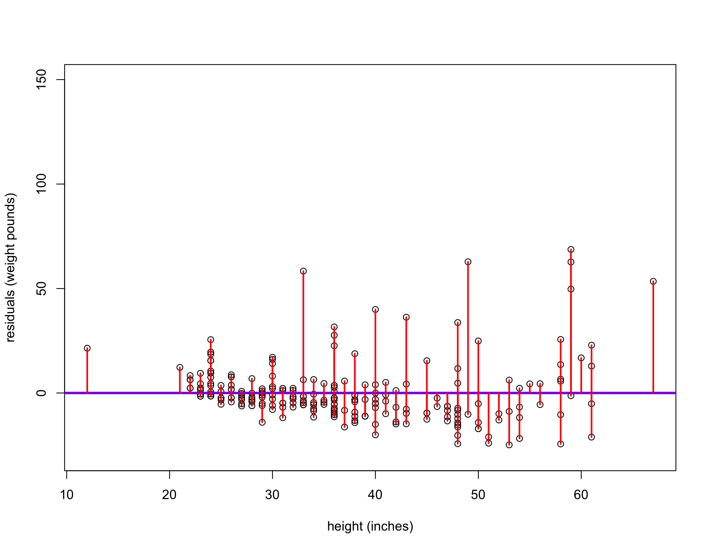

More about residuals (13/23)
=========================================================

Plot the residuals against the independent variable (X)

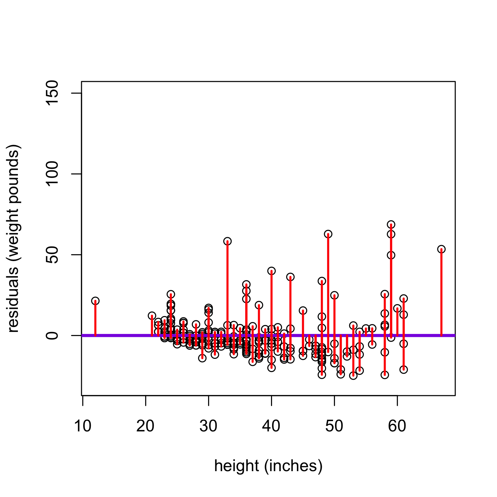

***
$$
Error_i = y_i - \hat{y_i}
\\

Error_i^2  = (y_i - \hat{y_i})^2
\\
\text{- sum of the square of the residuals (SSE)}
\\
SSE  = \sum_{i=1}^{n}(y_i-\hat{y_i})^2
$$


Interpret output of lm() - R-squared (14/23)
=========================================================

- The **R-squared** value represents the proportion of variability in the response variable that is explained by the explanatory variable.

- A high **R-squared** here indicates that the line fits closely to the data.


```r
> summary(lmResult)$r.squared
```

```
[1] 0.6785746
```


More about R-squared (15/23)
=========================================================

- Question: How would you describe (or summarize) kid's weight when the **height information is absence**? Which information you would use to predict a new child's weight?


```r
> kid.weights$weight
```

```
  [1]  38  87  50  98  47  30  24  45 144  24  40  15  20  10  19  29  80
 [18]  20  28  24  35  30  52  72  28  14  18  11  31  28  31  14  38  15
 [35]  27  60  40  40  21  47  46  30  69  76  16  11  38  25  29  21  36
 [52]  28  41  13  21  33  40  32  27  20  30  45  34  19  41  40  19  14
 [69]  43  90  45  29 105  94  22  69  17  27  12  40  25  13  20  16  45
 [86]  27  20  54  60  30  18  55  14  34  45  48  30  25  38  13  22  19
[103]  74  30  89  35  33  78  43  40  32  31  15  19  55  40  37  34  45
[120]  44  50  50  28  32  22  52  40  42  22  23  16  17  30  40  32  26
[137]  30  61  65  52  23  29  18  32  50  13  36  47  80  23  64  45  25
[154]  65  26  38  20 150  42  53  35  16 150  25  30  52  27  27  22  30
[171]  35  42  12  47  14  32  25  93  30  59 100  34  52  43  32  13  18
[188]  38  17  46  29  50  14  13  26  11  32  70  16  50  26  23  37  60
[205]  45  26 131  22  12  70  86  35  14  85  58  28  17  34  19  13  18
[222]  23  17  30  41  30  13 125  32  18  35  32 108  40  42  28  26  26
[239]  23  42  28  55  65  80  49  18  14  26  85  14
```

More about R-squared (16/23)
=========================================================

- Question: How would you describe (or summarize) kid's weight when the **height information is absence**? Which information you would use to predict a new child's weight?

- mean might be a good choice


```r
> mean(kid.weights$weight)
```

```
[1] 38.384
```

- If we have a new child, we could assume that the kid's weight is around 38.384 pounds.

More about R-squared (17/23)
=========================================================

- Question: How would you describe (or summarize) kid's weight when the **height information is absence**? Which information you would use to predict a new child's weight?

- mean might be a good choice

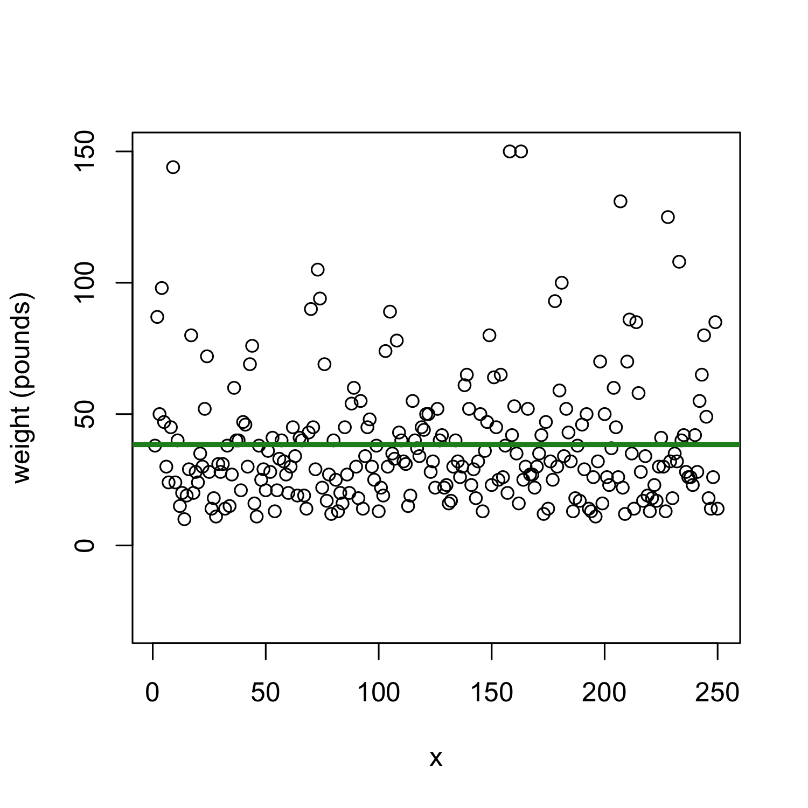

More about R-squared - TSS (18/23)
=========================================================


***
Residuals from the mean: assuming the independent variable (X), i.e. height in our case, does not exist

$$
TSS=\text{Total Sum of Squares}=\sum_{i=1}^n(y_i-\overline y)^2
$$


More about  about R-squared (19/23)
=========================================================

Residuals from the mean: assuming the independent variable (X), i.e. height in our case, does not exist

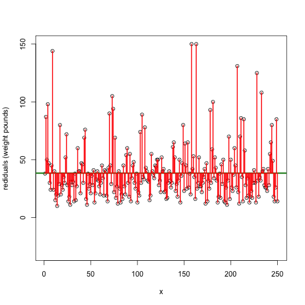

- Total Sum of Squares (TSS)

$$
  \begin{aligned}
  TSS  = \sum_{i=1}^{n}(y_i-\overline y)^2
  \end{aligned}
$$

***

Residuals from the model

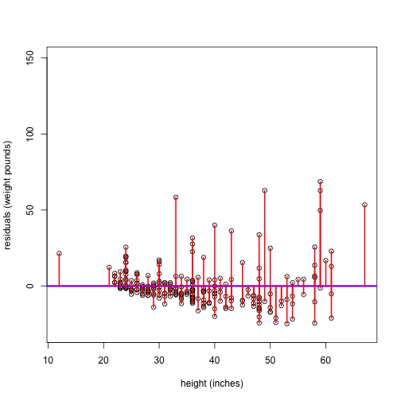
- Sum of the square of the residuals (SSE)
$$
SSE  = \sum_{i=1}^{n}(y_i-\hat{y_i})^2
$$

More about R-squared (20/23)
=========================================================

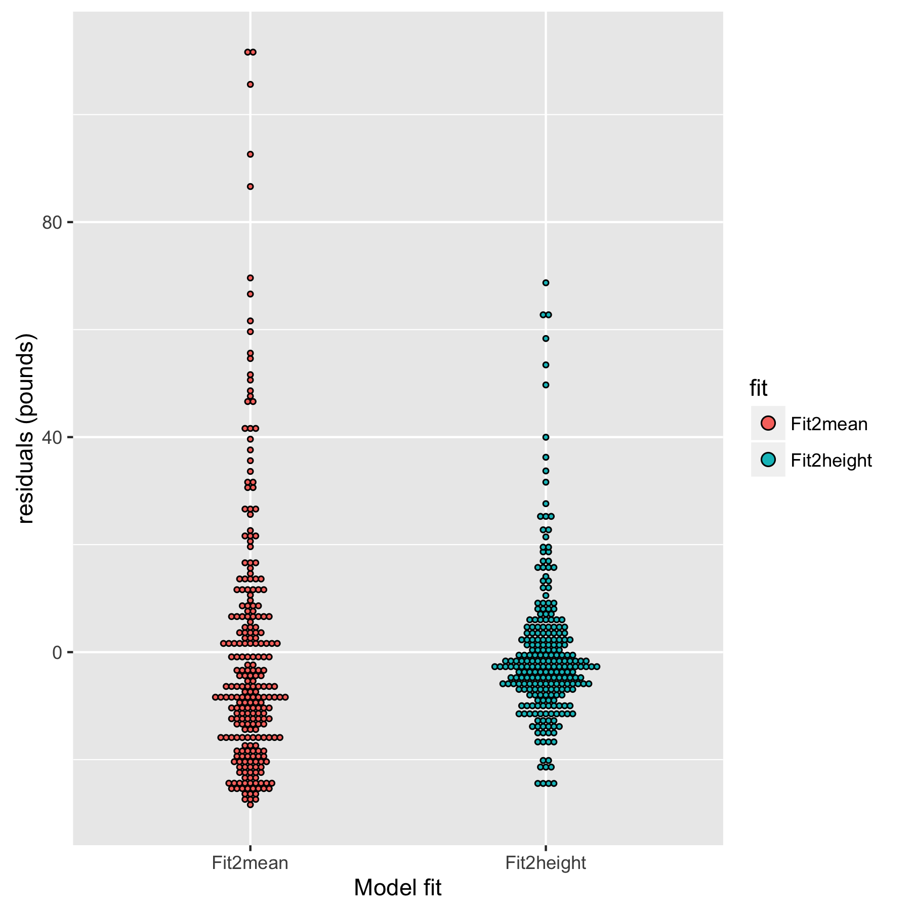

More about R-squared - Calculating R-squared (21/23)
=========================================================

The fraction of variability in the independent variable (Y; or the *weight* in this example) that can be explained by the explanatory variable (X; or the *height* in this example).

$$
TSS=\text{Total Sum of Squares}=\sum_{i=1}^n(y_i-\overline y)^2
\\
SSE=\text{Sum of the Square of the residuals}=\sum_{i=1}^n(y_i-\hat{y})^2
$$


```r
> SSE<-sum(resid(lm(weight~height,data=kid.weights))^2)
> TSS<-sum(resid(lm(weight~1,data=kid.weights))^2)
> R_square<-1-(SSE/TSS)
> R_square
```

```
[1] 0.6785746
```

```r
> summary(lmResult)$r.squared
```

```
[1] 0.6785746
```


Interpret output of lm() - F-statistics (22/23)
=========================================================

The R-squared shows the fraction of the total variability that is explained by the linear relationship with the explanatory variable. However, it does not provide a formal hypothesis test for this relationship. 

The F-test results from linear models also provides a measure of significance for a variable not being relevant


```r
> summary(lmResult)$fstatistic
```

```
   value    numdf    dendf 
523.5631   1.0000 248.0000 
```

More about F-statistics - Calculating F-stat (23/23)
=========================================================

$$
F=\frac{MSM}{MSE}=\frac{\text{mean of the explained variance}}{\text{mean of the unexplained variance}}=\frac{({\displaystyle\frac{SSM}1})}{({\displaystyle\frac{SSE}{n-2}})}
$$


```r
> n=nrow(kid.weights)
> SSM <- sum((predict(lmResult) - mean(kid.weights$weight))^2)
> MSE <-sum(lmResult$residuals^2)/(n-2)
> 
> MSM <-SSM/1
> 
> MSM/MSE
```

```
[1] 523.5631
```

```r
> summary(lmResult)$fstatistic
```

```
   value    numdf    dendf 
523.5631   1.0000 248.0000 
```


Statistics (Extra) - A fit line
=========================================================


Statistics (Extra) - Calculating R-squared
=========================================================

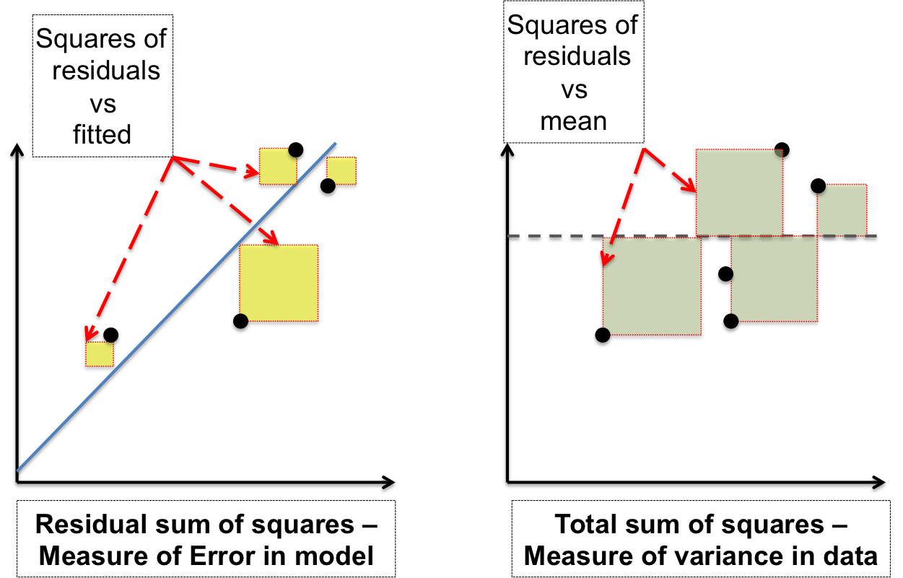


Time for an exercise!
========================================================

Exercise on this session can be found [here](exercises/Session3_exercise3.html)


Answers to exercise.
========================================================

Answers can be found [here](answers/Session3_answers3.html)


